# Kiriya's feeds: pipeline design

**Status:** design for approval, written 2026-09-15 (Singapore time). Nothing is built yet.
**Research:** source checks, prices and limits are in [`research/`](research/).

This design replaces the hand-written slides in the **Maomao appreciation club**, the **Miku/music** section and **a little dress-up**. Each becomes a personal daily feed. It also adds a **meme of the day**, a **merch shelf**, **saves** and a **my faves** page.

It reverses `docs/execute.md` §7, which banned live feeds, taste profiles and AI writing. The owner decided this on 2026-09-14.

---

## 1. The whole thing on one screen

```
every night, early-morning Singapore time (Vercel Cron, 5 short stages)

  fetch ──▶ check ──▶ score & plan ──▶ write ──▶ publish
  APIs,     rules +     taste profile,   bestie     editions +
  feeds     moderation  novelty, slots   blurbs     unseen reserve
            + vision

when she opens the site
  /api/me/feed/:section ──▶ unseen items first ──▶ "keep" saves a private copy
```

- **Every section serves a "meal":** about 10–15 items a day, plus a reserve that fills later visits. An item she's seen never comes back in a feed.
- **Everything is credited** to its creator and links to the original post.
- **Blurbs are AI-written** in one bestie voice (lowercase texting, deadpan loving roast) and signed **✦ kiriya.love**.
- **Safety runs in layers** before anything goes live: source ratings, labels, free OpenAI moderation, a vision check and rule filters. YouTube is the exception (owner decision, 2026-09-17): its own checks — strict SafeSearch on every search, age restriction, made-for-kids, and its policy enforcement — stand in for the paid vision read, so the budget goes to the sources that have no checks of their own, and a YouTube item's tags decide which sections it may fill. The owner can still hide anything from /admin afterwards.
- **Hard no's:** explicit or suggestive content, AI-generated art, gore/horror images, drama.
- **Expected running cost:** about **$1–2/month** of OpenAI usage. Every other service stays on a free tier.

## 2. Decisions from the Q&A (2026-09-14)

**How it runs**

| Area | Decision |
| --- | --- |
| Freshness | A daily drop built overnight, plus unseen extras on later visits; nothing repeats |
| Approval | Auto-publish after filters and AI checks; the owner can hide items in /admin |
| AI | A small OpenAI model writes blurbs and runs checks; budget "a few dollars a month" |
| Saves | Keep private copies (limits in §10) |
| Controls | She edits **my faves**. No manual link drops, no feed notifications |
| Accounts | The owner will create a YouTube Data API key, a Tumblr API key and a Bluesky account. acgevents.sg won't be contacted. Vercel plan: **Hobby** |
| Volume | About 10–15 items per section per day |
| Hard no's | Explicit (always), suggestive, AI-generated art, gore and horror images, drama and controversy |

**The voice**

| Area | Decision |
| --- | --- |
| Narrator | One bestie voice everywhere, signed **✦ kiriya.love** |
| Style | Lowercase texting; deadpan; barely any emoji; keyboard smashes or CAPS only for real excitement |
| Spice | Loving roast of her obsessions, never of creators |
| Voice may mention | Her past cosplays, her art ("u could draw this"), what she's saved, inside jokes (none supplied yet) |
| Humour line | Dark and relatable is fine. **No self-harm or suicide jokes. No jokes about family or body/appearance** |
| Name | Just "kiriya"; gender-neutral wording throughout |
| Memes | Fandom memes in every section, general anime and relatable memes as a **meme of the day** on home. Formats: POV/"me when", screenshot text posts, reaction images, unhinged fandom memes. Gen Z Instagram/TikTok culture, **not brainrot**. Minecraft appears only in memes and jokes |

**Maomao club**

| Area | Decision |
| --- | --- |
| Spoilers | None; she has read the light novels |
| Ships | Fine |
| Slides | Anything with Maomao: fan art, official art, anime scenes and clips, cosplay crossovers |
| Loves | Poison and herb nerd moments, the disgusted side-eye, case-solving arcs, Verdigris House scenes |
| Side characters | Pairin, Meimei and Joka (the Verdigris House sisters), Xiaolan, Gaoshun |
| Season 3 | **Episode-day mode** |

**Music**

| Area | Decision |
| --- | --- |
| Songs | Classics, modern hits, Rin & Len story songs |
| Producers | "A smidge of each": spread widely, no favourites |
| Voicebanks | Miku first; Rin and Len; also Luka, KAITO, MEIKO, Kasane Teto, GUMI |
| Project SEKAI | **Global (English) server**, virtual singers first. Units: Wonderlands×Showtime, Vivid BAD SQUAD, Leo/need. News: events, cards and gacha, new songs, anniversaries and collabs. Official card art can't be reposted, so card news is text plus a link, shown next to fan art |
| Music extras | SEKAI unit covers. Merch matters a lot, with shop links. Human (utaite) covers and concert clips aren't prioritised |

**Dress-up**

| Area | Decision |
| --- | --- |
| Daily three | A Miku cosplay, a Maomao cosplay, and a character from **a rotating fandom** |
| Her photos | One of her own cosplays in every daily lineup |
| Cosplay posts | Shoots, wig and makeup process, transformation videos, "can u pull this off?" dares. Anything in her fandoms or nearby |
| Cosplay wishlist | More Miku versions; Frieren and Witch Hat Atelier characters |
| Follows creators on | Instagram and TikTok (no APIs, so link-only) |
| Events | Singapore plus big regional ones. Her picks: AFA Singapore, Singapore Comic Con, The Apothecary Diaries Exhibition |
| Extras | J-fashion looks (Y2K and skater streetwear, sweet and girly), Singapore shoot spots, wig and materials finds, the Singapore cosplay scene |

**Her world**

| Area | Decision |
| --- | --- |
| Games | Project SEKAI (Global); Genshin ("a bit of everyone"); Honkai: Star Rail; Minecraft (jokes only) |
| Other anime | Frieren, Bungo Stray Dogs, Witch Hat Atelier, music and idol anime (Oshi no Ko, Bocchi the Rock!, Girls Band Cry), anything Vocaloid |

**Merch**

| Area | Decision |
| --- | --- |
| What | Every type, every fandom |
| Where it appears | A merch line in each section, plus a full merch shelf |
| Shops | Shops that ship to Singapore first; prices in SGD |
| Budget | Mid-range (S$30–100) first, but show everything |
| Already collects | Acrylic stands and badges, Nendoroids and scale figures, prize figures and plushies, shirts and pins |
| Buys from | Taobao, local stores in person, Japanese shops |

**Updates to the old profile** (`server/content/kiriya.js`):
- Spoiler level: manga → none.
- "Not into shipping" → ships are fine.
- Fashion: now Y2K and skater streetwear plus sweet and girly.
- Games and anime lists added.

## 3. Her taste profile

The profile is a single server-side object: defaults in `server/content/taste.js`, merged with her edits from my faves (settings key `taste_overrides`). The scorer, the planner and the writer all read it. Only interests reach OpenAI, never identity details (as in the existing writer).

### Starting weights (0–1)

Tunable in admin.

**Characters**

| Group | Weight |
| --- | --- |
| Maomao | 1.0 |
| Pairin, Meimei, Joka, Xiaolan, Gaoshun | +0.2 bonus each when they appear alongside Maomao |
| Hatsune Miku | 1.0 |
| Kagamine Rin and Len | 0.8 |
| Luka, KAITO, MEIKO, Teto, GUMI | 0.5 |
| SEKAI virtual singers (SEKAI outfits) | 0.9 |
| Members of Wonderlands×Showtime, Vivid BAD SQUAD, Leo/need | 0.6 |
| Other SEKAI units | 0.3 |

**Fandoms for the rotating cosplay slot and memes**

| Group | Weight |
| --- | --- |
| Project SEKAI, Genshin (all characters equal), Honkai: Star Rail, Frieren, Witch Hat Atelier, Bungo Stray Dogs | 0.7 |
| Oshi no Ko, Bocchi the Rock!, Girls Band Cry | 0.5 |
| Minecraft (memes only) | 0.4 |

**Other tags**

| Group | Weight |
| --- | --- |
| Songs: classics (2007–2013), modern hits, Rin & Len story songs | 0.8 each |
| Songs: new releases by her voicebanks | 0.7 |
| Producers | Neutral. A diversity penalty (no producer twice in 7 days) enforces "a smidge of each" |
| Maomao moments: poison/herbs, disgusted face, case-solving, Verdigris House | +0.15 bonus when tags or text match |
| Cosplay wishlist: Miku versions (Snow, Sakura, Magical Mirai, SEKAI), Frieren and Witch Hat Atelier characters | +0.2 bonus; also the preferred picks for dares |
| Merch within S$30–100 | +0.15 |
| Merch types she collects | +0.1 |

The profile also lists her events (AFA SG, SGCC, the Apothecary Diaries Exhibition) for countdowns, her fashion styles, her past cosplays (Maomao, Hatsune Miku, Lynette), her wig styling, and her off-limits joke topics.

## 4. Architecture

```mermaid
flowchart LR
  subgraph Sources
    DB[Danbooru]:::src
    BS[Bluesky]:::src
    SB[Sakugabooru]:::src
    TU[Tumblr]:::src
    YT[YouTube Data API]:::src
    AL[AniList]:::src
    RSS[News RSS]:::src
    FW[Fandom / Wikipedia]:::src
    MU[Music sources §5.2]:::src
    ME[Meme sources §5.4]:::src
    MR[Merch sources §5.5]:::src
    EV[Event pages]:::src
  end
  Sources --> F[fetch stages<br/>adapters → feed_items]
  F --> C[check stage<br/>rules · moderation · vision]
  C --> P[plan stage<br/>score · slots · reserve]
  P --> W[write stage<br/>Luna blurbs · validators]
  W --> PUB[publish stage<br/>feed_editions · deletion rechecks · pruning]
  PUB --> API[/api/me/feed/:section/]
  API --> UI[Maomao club · Music · Dress-up · Meme of the day · Merch shelf]
  UI -->|keep| SAVE[saves → private Blob copy]
  UI -->|seen| SEEN[feed_seen]
  FAV[my faves] --> P
  FAV --> W
  ADMIN[/admin: hide · health · runs · storage/] --> PUB
```



### Code layout

The feeds get their own folder, separate from the old daily bundle.

```
server/feeds/
  sources/        one adapter per source: fetch(ctx) → FeedItem[]  (§5)
  normalize.js    the shared FeedItem shape and hashing
  rules.js        stage-A rules: ratings, labels, tags, text patterns (§7)
  moderate.js     OpenAI moderation (free) and vision checks (Luna)
  taste.js        defaults merged with her overrides; tag → weight matching
  score.js        relevance, freshness, quality, diversity, boosts
  plan.js         section slot plans, reserves, episode-day mode, rotation
  writer.js       batched strict-JSON blurbs, validators, template fallback
  voice.js        persona, rules, meme lexicon, banned patterns
  events.js       weekly events refresh with verbatim-date checks
  saves.js        private copies, byte accounting, deletion policy
  jobs.js         stage runner, lease rows, deadlines, retention
server/routes/feeds.js        /api/me/feed/*, /api/me/saves/*, /api/me/faves, /api/me/merch, /api/me/meme
server/routes/admin.js        + feed review, health, runs, events, storage
server/routes/jobs.js         + /api/jobs/feeds/:stage (CRON_SECRET)
```

### What stays and what gets reused

- **Kept:** the old `server/engine/` daily bundle keeps powering the greeting, drawer, letters and notes.
- **Reused:**
  - `server/lib/http.js`: timeouts and `settle`.
  - The writer pattern in `server/engine/writer.js`: Responses API, strict schema, zod, `store: false`.
  - The VocaDB and AniList adapters.
  - The private Blob media route and the claim-a-row pattern from `server/push/planner.js`.

## 5. Sources

Every adapter has the same contract:
- **Polite requests:** a descriptive User-Agent, a per-source rate limit, a timeout and one retry.
- **Normalized output:** it returns FeedItems.
- **Health tracking:** each run records success or failure, item counts and duration in `feed_source_health`.

A failing source only loses its own items. When a whole section comes up short, the planner fills from the reserve and yesterday's unseen items.

**All "verified" results below come from a home connection. Before launch, rerun every adapter once from a Vercel preview deployment**, because Cloudflare and Reddit-style blocking target cloud IPs.

### 5.1 Maomao club

| Source | Used for | Access | Notes |
| --- | --- | --- | --- |
| **Danbooru** `posts.json` | Fan and official art, MP4 clips | Keyless; custom User-Agent; ~1 request/s | Tag `maomao_(kusuriya_no_hitorigoto)` with `rating:g age:<30d score:>=8`. The anonymous 2-tag limit means filtering `ai-generated`/`ai-assisted` in code from `tag_string_meta`. Hotlink `720` or `sample` variants. Credit `tag_string_artist` and the `source` link |
| **Bluesky** `app.bsky.feed.searchPosts` on `api.bsky.app` | Fan art, GIF-style clips (HLS), posts | Keyless search today (first page only, throttled on bursts). The owner's Bluesky account is the backup login | Queries: `maomao fanart`, `tag=maomao`, `猫猫 薬屋のひとりごと`, sorted top with `since`. Fallback: the Kusuriya custom feed via `getFeed` |
| **Sakugabooru** | Anime cuts as MP4 | Keyless | Tag `kusuriya_no_hitorigoto`. Vision-check the sample image to make sure Maomao is in the cut. Credit the animators |
| **Tumblr** `/v2/tagged` | GIF sets, art | API key (owner) | Tags `maomao`, `the apothecary diaries`, `kusuriya no hitorigoto`. Credit the blog and source. Re-check within 24 h for deletions; don't keep media beyond Tumblr's caching rules |
| **AniList** GraphQL | S3 airing schedule, episode numbers | Keyless; 30 requests/min | IDs: S3 `195516`, S3 part 2 `200927`, film `200929`. Drives episode-day mode |
| **News RSS** | News | Keyless | ANN (SEA edition), Crunchyroll News, Anime Corner; MAL news as backup. Keyword filter `apothecary\|kusuriya\|maomao\|薬屋`. Summarize and link; never republish articles |
| **Fandom** MediaWiki API (`kusuriya.fandom.com`) | Lore, character facts, episode tables | Keyless, API only (the HTML is behind Cloudflare) | CC BY-SA: credit the page. Blurbs cite it |
| **Wikipedia** API | Episode titles, air dates, short summaries | Keyless | CC BY-SA |
| **YouTube Data API** | Trailers and PVs | API key (owner) | `playlistItems.list` on the official channels' uploads playlists (IDs looked up once with `channels.list?forHandle=`) |
| **Events table** (§8.6) | The Apothecary Diaries Exhibition, 30 Sep–1 Nov 2026, Fever Exhibition Hall, 25 Scotts Rd | — | Shown in the club while it runs |
| Merch (§5.5), memes (§5.4), cosplay crossovers (§5.3) | Merch line, meme slides, Maomao cosplays | — | — |

Current facts the club can use (sources in `research/maomao-sources.md`):
- **Season 3** premieres **Fri 2 Oct 2026 at 22:00 SGT** (23:00 JST, NTV). Netflix says it streams "only on Netflix in select regions of Asia". The second cour comes in April 2027.
- **Film:** *The Deceased Empress' Treasure* opens in Japan on **11 Dec 2026**. No Southeast Asian date yet.
- **English releases:** *Xiaolan's Story* vol. 1 on 6 Oct, *Maomao's Notes on the Inner Palace* vol. 1 on 20 Oct, manga vol. 16 on 3 Nov.
- **Game:** *The False Imperial Brother* (Koei Tecmo/Gust), early 2027.

### 5.2 Music (Miku, Vocaloid, Project SEKAI Global)

Full probe results and all IDs are in [`research/vocaloid-sources.md`](research/vocaloid-sources.md).

| Source | Used for | Access | Notes |
| --- | --- | --- | --- |
| **VocaDB** API | Song discovery and credits: new songs, classics, Rin & Len story songs, SEKAI songs, events | Keyless; custom User-Agent; cached. Well under "thousands per day" | See **VocaDB queries** below |
| **YouTube Data API** | Most of the feed (owner decision, 2026-09-17): official music uploads, cosplay how-tos and showcases, Apothecary clips, and her fandoms' memes | API key (owner). `channels.list`/`playlistItems.list`/`videos.list` cost 1 unit; **`search.list` costs 100 units**, all from the same 10,000/day bucket. About 1,200 units a day across the five collectors | Keep only videos where `status.embeddable` is true and `contentDetails.regionRestriction` doesn't block SG. `UULF…`/`UUSH…` playlist prefixes are undocumented and unused: Shorts are recognised by shape and duration (`isShort`), dropped by the music collector and **kept** by the meme, cosplay and Apothecary collectors, where a Short is `kind: "clip"` and tagged `short`. Uploads found by `search.list` carry `search_result` provenance and publish only for the collectors whose entry sets `searchProvenance` — the moderation gate still sees the thumbnail only. Match music back to VocaDB via `byPv` for credits. Refresh stored API data within 30 days. Channel RSS is a fallback only: it has daily outages around 05:30–07:00 UTC, while our fetch runs at 17:05 UTC |
| **YouTube oEmbed** / `i.ytimg.com` | Embed checks, thumbnails | Keyless | Embeds need the site's Referer (§13) |
| **Sekai-World master DB, Global copy** (`sekai-master-db-en-diff`) | Global events (name, unit, start and end), new songs | Keyless; GitHub Pages with ETag | **Only rows where `startAt <= now`**; future rows are datamined leaks. Virtual singer items first; then her units |
| **Official SEKAI Global news** `colorfulstage.com/news/all/entries.txt` | Anniversaries, collabs, campaigns, card and gacha announcements | Keyless | Parse leniently (trailing commas). **Text plus the official link only** |
| **piapro blog RSS** (`blog.piapro.net/feed`, `/tag/event-magical-mirai/feed`) | Crypton news and events | Keyless; supports 304 | Japanese; the writer translates faithfully |
| **ANN press-release RSS**; Siliconera `/tag/hatsune-miku/feed/` | English news | Keyless | Keyword filter (miku, vocaloid, project sekai, crypton, magical mirai, kagamine, teto, …). Siliconera is optional (Cloudflare) |
| **Danbooru** | Miku and Vocaloid fan art; **real GIFs** via `animated_gif` | Keyless, ~1 request/s | `hatsune_miku -ai-assisted rating:g age:<7d score:>=10`, plus per-voicebank and SEKAI virtual singer tags. Drop `is_deleted` and `is_banned` |
| **Bluesky** | Artist posts | Owner's login; unauthenticated search returned 403 for music queries | Allowlisted artists via `getAuthorFeed`, plus logged-in search; labels filtered |
| **Tumblr** `/v2/tagged` | Fan art, GIF sets | Owner's key | Lower priority |
| **iTunes Search** (SG store) and VocaDB album `WebLinks` | "Open in Apple Music / Spotify" links on song cards | Keyless, ~20 calls/min | Odesli is retired, and Spotify's API now needs a Premium-owned app |
| **Niconico Snapshot API** | Backup for songs with no YouTube upload | Keyless, non-commercial | Optional; wait between calls |

**VocaDB queries**
- **Voicebanks** (with `childVoicebanks=true`): Miku `1`, Rin `14`, Len `15`, plus Luka, KAITO, MEIKO, Teto and GUMI. Confirm those five IDs at build.
- **Excluded tags:** `9119`, `9887`, `10766`, `11828` (AI) and `320` (sexual).
- **Query set:**
  - **New originals** from the last 14 days, ranked once they're 48–72 h old so ratings have settled.
  - **Classics:** published 2007–2013, `sort=RatingScore`.
  - **Rin & Len story songs:** tag `6965` with artist 14 or 15.
  - **Modern hits:** 2014 onward, by rating.
  - **SEKAI:** tag `7323`; unit artists Wonderlands×Showtime `84505`, Vivid BAD SQUAD `86692`, Leo/need `84782`.
  - **Producer rotation:** one request per producer, since multiple IDs are ANDed. Rotate 3–4 of the 22 verified producers each night, so everyone gets "a smidge".
- **Credit:** VocaDB, under CC BY.

**Official SEKAI art can't be shown.** The image host blocks hotlinking, and SEGA forbids reposting. Card and gacha news appears as text plus the official link, next to fan art of the same characters when available.

**Current facts the music section can use** (sources in the research file):
- **Global World Link finale "Wishes in Bloom!":** 26–29 Sep 2026.
- **JP 6th anniversary:** 30 Sep. The Thanks Festival is 3–4 Oct in Tokyo, with cinema live viewings in Malaysia and Indonesia but **not Singapore**.
- **COLORFUL LIVE 6th - Crossing -:** Kobe 25–27 Dec 2026; Yokohama 26–28 Feb 2027.
- **MIKU EXPO:** the 2026 Europe tour runs in November. **No Asia or Singapore dates are announced for 2026–27**; the last Singapore show was 19 Nov 2025.
- **Magical Mirai 2027:** July–August in Hiroshima, Osaka and Tokyo.
- **Singapore:** a "songs we like" Miku & Teto fan concert on 14 Nov, from a listing only (unconfirmed).

### 5.3 Dress-up

| Source | Used for | Access | Notes |
| --- | --- | --- | --- |
| **Bluesky** search | Cosplay photos (daily three, crossovers, Singapore scene) | Keyless first page, backup login | About 15 narrow queries a day, e.g. `tag=maomao q=cosplay`, `猫猫 コスプレ`, `miku cosplay`, `#mikucosplay`, `初音ミク コスプレ`, `project sekai cosplay`, `genshin cosplay`, `frieren cosplay`, `fern cosplay`, `witch hat atelier cosplay`, `bungo stray dogs cosplay`, `honkai star rail cosplay`, `cosplay singapore`. Keep posts with images, no labels, and self-made cues ("my", "me as", "cosplayer:") |
| **Tumblr** `/v2/tagged` and allowlisted blog RSS | Cosplay photos, WIPs | API key (owner) | Blogs found along the way can be added to an allowlist in admin |
| **YouTube Data API** | Transformation videos, wig and makeup tutorials | API key (owner) | Uploads playlists: Kleiner Pixel `UCJifGeBP7fl59XwxeUYM7ag`, Hanie Comb `UCn5_or6x8HqYbl3kVDimgJg`, Epic Cosplay Wigs `UCJRIterpI7fH_c7U6p0jHOg`, Cowbutt Crunchies `UCbSST-QoAQKqtgZbmf3gI3g`, Franciscosplays `UCiDvE4FTPu2oPIXyn6EJNcw`, Kamui Cosplay `UC79qFuymkVas5dCScbLF9fw`. Plus up to 5 `search.list` calls a day (separate 100/day bucket) with `safeSearch=strict` |
| **Arda Wigs** Atom `arda-wigs.com/blogs/news.atom` | Wig finds, Iron Wig contest | Keyless | |
| **SoraNews24** `soranews24.com/tag/cosplay/feed/` | Cosplay news | Keyless | |
| **Kamui Cosplay** feed | Build write-ups (rare) | Keyless, slow (~100 s) | Conditional GET only, in its own stage slot; failures are allowed |
| **Her photos** | One in each daily lineup | Existing cosplay uploads (`cosplay_projects.coverUrl`, public cosplay photos) | Least recently shown first |
| **Event pages** (§8.6) | Events | Keyless, weekly | Official pages plus structured data |
| **Bluesky** tag search (owner's login) | J-fashion looks: `#y2kfashion`, `#harajukufashion`, `#lolitafashion` | ≥4 s between queries | The vision check classifies style (`y2k`, `skater`, `sweet`, `girly`, `other`) and keeps her two families: Y2K/skater streetwear and sweet/girly. Drop labelled posts and `!no-unauthenticated` authors |
| **ACDC RAG** `products.json` | Occasional new J-fashion pieces | Keyless | Low weight. Her sweet and girly brands (Liz Lisa, Angelic Pretty) have no feeds |
| **Arda Wigs** Atom, wig YouTube channels, SoraNews24 | Wig and materials finds | As above | Wig shops whose Shopify terms forbid crawling aren't polled |
| **Shoot spots** pool in `server/content/shootSpots.js` | Singapore shoot spots | Written into the repo from research | Chinese & Japanese Gardens (reopened Sep 2024), Fort Canning spiral staircase, HortPark, Labrador Park, Marina Barrage at night, Boat Quay, Sentosa Boardwalk, Punggol, studios. Each entry carries permit facts quoted from NParks / Gardens by the Bay with links. One card a week, paired with a character (e.g. Chinese Garden ↔ Maomao) |
| **Singapore scene** | Local cosplay happenings | Events table (§8.6: AFA Cosplay Singles, SGCC, COSSET), Bluesky posts with Singapore cues, plus **creators she adds in my faves** (shown as link cards) | Automated discovery of Singapore creators isn't feasible (#sgcosplay is dead; Instagram and TikTok have no discovery API) |

### 5.4 Memes

Reddit is closed, so memes come from Lemmy, fixed Bluesky feeds and accounts, a few Tumblr fandom blogs and Danbooru's meme tag. Full probe results are in [`research/meme-sources.md`](research/meme-sources.md).

**Every meme candidate gets a meme check.** Most meme posts have no useful title or alt text, so the vision step (§7) reads the image and returns:

```json
{"isMeme":true,"format":"pov|me_when|text_post|reaction|comic|other",
 "humor":"relatable|dark|absurd|wholesome|brainrot",
 "political":false,"topics":["sleep","exams"],"text":"…readable caption…","fandom":"project sekai"}
```

The check rejects `political`, `brainrot`, anything touching self-harm, family or body jokes, and anything suggestive. `wholesome` is ranked lower, since she wants relatable, dark or funny rather than cookie-cutter. The formats she picked (POV/"me when", screenshot text posts, reaction images, unhinged fandom memes) get +0.2.

| Where it appears | Sources | Expected supply |
| --- | --- | --- |
| **Meme of the day** (home; general anime and relatable) | Lemmy `memes@lemmy.world` (bans politics), `me_irl@lemmy.world`, `animemes@ani.social`, `anime_irl@ani.social`, `onehundredninetysix@lemmy.blahaj.zone` (politics filter applies). Bluesky @adhdforreal.bsky.social and @wholesomememe.bsky.social (lower weight). Danbooru `meme rating:g` for anime formats | Plenty: 20+ relatable and ~4 anime a day before checks |
| **Maomao club** meme slides | Bluesky Kusuriya feed (`at://did:plc:knoh46c6xff6lrdcfs2q5y4a/app.bsky.feed.generator/aaaaabqzpdxj4`) and `q=maomao`, both through the meme check. @murmurlilies.bsky.social. Tumblr `ghostinthegutter` RSS. Danbooru `kusuriya_no_hitorigoto meme` back catalogue (27 posts, IDs only) | About 1 a day; empty days allowed. Unused meme slots go to other notes |
| **Music** meme slot | Tumblr `pjsk--shitposts` and `project-sekai-but-incorrect` RSS (SEKAI text posts). Lemmy `vocaloid@ani.social`, `hatsunemiku@lemmy.world`. Bluesky Vocaloid and SEKAI feeds through the meme check. Danbooru `project_sekai meme` / `vocaloid meme` back catalogue | About 3–5 a day |
| **Dress-up** meme slot | Almost no living source (the Bluesky cosplay feeds mix in adult content and aren't used) | Usually empty; the slot goes to another item |
| **Minecraft** | Voice jokes only, plus the occasional meme from `minecraft@lemmy.world` or Danbooru's back catalogue | Rare, by design |

**Rules specific to memes:**
- **Lemmy:**
  - Drop `nsfw`, `deleted`, `removed`, and posts from NSFW communities.
  - Skip `lemmyshitpost`.
  - Use `TopDay` sorting.
  - Credit the community and poster, and link `ap_id`.
  - Re-check the post before publishing.
- **Tumblr blog RSS:** follows Tumblr's cache (≤3 days) and deletion (≤24 h) rules.
- **Politics:**
  - Keyword filter: names of politicians and parties, election, war, shooting, assassination, protest, plus the vision check's `political` flag.
  - Meme spaces were dominated by political posts during the research week, so this filter is mandatory.
- **Media:** hotlinked, never rehosted.

### 5.5 Merch

Data comes only from sources whose terms allow automated reads, about 35 requests a night. Everything else is a plain link. Full results are in [`research/merch-and-fashion.md`](research/merch-and-fashion.md).

| Source | Used for | Access | Notes |
| --- | --- | --- | --- |
| **Solaris Japan** `products.json` (Shopify) | New listings of every figure type, including prizes and plushies. Ships to SG | Keyless; one request a night (newest 250) | Match franchise tags and titles to her fandoms (list below). Type comes from `meta-figure-*` tags. Fetch product-page JSON-LD only for matches (release date, GTIN). USD → SGD |
| **Good Smile Company** `/en/releaseinfo` + product JSON-LD | Nendoroid, figma and scale: JPY price, **preorder window** (`availabilityEnds` is the deadline), GTIN, image. Ships to SG | Keyless; releaseinfo once a night, JSON-LD for new matches (cached) | Respect robots.txt (`/*/search` is off-limits); keep requests few |
| **Crypton goods RSS** `blog.piapro.net/category/goods/feed` | Official Miku, Vocaloid and SEKAI goods and collab announcements | Keyless | Japanese; the writer translates. `og:image` for pictures |
| **Colorful Palette Store** (official PJSK goods, JP) | SEKAI goods and preorder windows | Keyless, HTML | Optional; weekly; a handful of pages, to stay well within fair use |
| **SEGA Plaza** calendar | Upcoming prize figures (JP arcades) | Keyless, HTML | Optional; weekly. Framed as "arcade prize, watch for it at resellers" |
| **HobbyLink Japan** | An extra retailer link and price for already-matched items | Keyless (robots.txt allows search; product JSON-LD) | Optional |
| **Frankfurter** | JPY/USD → SGD rates | Keyless, once a night | Prices labelled "≈ S$" |
| **Singapore shops** (ToyCoin, TOG, Otaku House, Candytoyo, Kinokuniya) | "Buy in SG" | **Search links only** (`…/search?q=<product>`) | Their Shopify terms forbid crawling, so no polling without permission. In-person notes from research: Otaku House (Suntec, PLQ, Jewel), TOG (Plaza Sing, Bugis+), Toy Outpost lockers, Gashapon Bandai shops |
| **Taobao** | Search link | `s.taobao.com/search?q=…` | The blurb reminds her to check the listing says 正版, since bootlegs are common (approved) |

**Matching her fandoms** on titles and franchise tags:
- Hatsune Miku / Vocaloid (Rin, Len, Luka, KAITO, MEIKO, Teto, GUMI)
- Project SEKAI
- Kusuriya no Hitorigoto (The Apothecary Diaries)
- Genshin Impact, Honkai: Star Rail
- Sousou no Frieren
- Bungou Stray Dogs
- Tongari Boushi no Atelier (Witch Hat Atelier)
- Oshi no Ko, Bocchi the Rock!, Girls Band Cry

**One card per product:**
- Items from Solaris and GSC are joined on JAN/GTIN.
- **Card contents:** image (hotlinked from the shop CDN), name, maker, type, ≈S$ price with the original price, preorder deadline or release month.
- **Link order:** official shop → Singapore search links → Solaris/HLJ → Taobao.

**Domain allowlist for every shop link.** Known fakes and hijacked domains are blocked: hoyo.global, hoyoversemerch.com, hoyoverseofficial.store, theapothecarydiariesmerch.com, marsjp.com, hakkenonline.com.

**Budget:** S$30–100 sorts first; every price is shown.

### 5.6 Rejected sources, and why

| Source | Why not |
| --- | --- |
| Reddit | Self-serve API closed Nov 2025; JSON returns 403 even from a home IP; robots `Disallow: /`; blocks cloud IPs |
| GIPHY, KLIPY | Their terms forbid server-side filtering, caching and mixing with other content. That rules out this design |
| Tenor | API shut down 30 Jun 2026 |
| Instagram, TikTok | No discovery APIs for personal apps; oEmbed only works for links already in hand (and the owner declined manual link drops) |
| Pinterest, RedNote, Lemon8 | No usable access; robots disallow |
| WorldCosplay | Domain now serves gambling spam |
| Flickr | Keyless feed disallowed by robots; API keys need Flickr Pro |
| DeviantArt | Mostly AI and fan art; API needs an app |
| Pixiv, Zerochan, Gelbooru | No official API / credentials required |
| The Apothecary Diaries official site | Cloudflare challenge; link to it only |
| acgevents.sg | Terms ban bots without permission; the owner chose not to ask |
| YouTube channel RSS | Disallowed by robots and has daily outages; use the Data API |
| Odesli / song.link | Public API retired 2026-07-31 |
| Official Project SEKAI images (storage.sekai.best) | Hotlinking blocked; SEGA forbids reposting |
| piapro.jp | Crawling banned by its user agreement |
| MyFigureCollection, AmiAmi, Play-Asia | Cloudflare blocks |
| Tokyo Otaku Mode, CDJapan, Big in Japan | No usable feed / dead feed / domain for sale |
| Square Enix e-STORE, Movic, animate | No shipping outside Japan / proxy only / 1180 s crawl-delay |
| Shopee, Lazada | Seller-only APIs, captchas |
| Polling Singapore Shopify shops | Their terms forbid crawling; search links instead |
| 9GAG, iFunny, me.me, Memedroid | Blocked, and their terms |
| Know Your Meme, Urban Dictionary | Terms forbid aggregation / API needs permission |
| Tokyo Fashion RSS | Stale since 2024 |

## 6. Data model

New tables through a Drizzle migration. Nothing existing is dropped.

### `feed_items`: every normalized candidate

| Column | Type | Notes |
| --- | --- | --- |
| `id` | text PK | `source:nativeId`, e.g. `danbooru:12165589`, `bsky:at://…` |
| `source` | text | Adapter name |
| `section` | text | `maomao` \| `music` \| `dressup` \| `meme` \| `merch` |
| `kind` | text | `image` \| `clip` \| `song` \| `video` \| `news` \| `lore` \| `event` \| `cosplay` \| `tutorial` \| `dare` \| `merch` \| `meme` \| `look` \| `spot` \| `creator` |
| `title` | text | |
| `url` | text | Original post or page |
| `media` | jsonb | `[{type: image\|mp4\|hls\|youtube, url, width, height, poster, alt}]` |
| `credit` | jsonb | `{name, handle, profileUrl, platform, license}` |
| `tags` | jsonb | `{characters[], fandoms[], voicebanks[], producers[], units[], formats[], topics[]}` |
| `facts` | jsonb | Verbatim excerpts the writer may use (≤600 chars each), dates, prices |
| `safety` | jsonb | Source rating and labels, moderation scores, vision verdict |
| `status` | text | `new` → `checked` → `approved` \| `rejected` → `planned` → `live` \| `hidden` \| `gone` |
| `reject_reason` | text | |
| `hidden_by` | text | `owner` \| `kiriya`, when `status = hidden` |
| `score` | real | |
| `blurb` | jsonb | `{headline, text, cta, model, promptVersion, writtenAt}` |
| `content_hash` | text, unique | Normalized URL plus media hash, for dedupe across sources |
| `published_at`, `fetched_at`, `expires_at` | timestamptz | `expires_at` covers events, preorders, source cache limits (e.g. Tumblr) and YouTube's 30-day refresh |

Indexes: `(section, status, score desc)`, `(source, fetched_at)`, `(expires_at)`.

### Other tables

- **`feed_editions`** `(day, section)` PK: `slots` (ordered item IDs), `reserve` (ordered item IDs), `meta` (episode-day info, rotation fandom, her photo ID, counts), `published_at`.
- **`feed_seen`** `item_id` PK, `first_seen_at`. There's one viewer (the owner's preview doesn't mark items seen).
- **`feed_runs`** `(stage, day)` PK: `status`, `lease_until`, `started_at`, `finished_at`, `stats` jsonb, `error`.
  - Neon's HTTP driver can't hold advisory locks, so a stage claims its row atomically: `INSERT … ON CONFLICT DO UPDATE … WHERE status <> 'done' AND lease_until < now() RETURNING`.
- **`feed_source_health`** `source` PK: `last_ok_at`, `last_error_at`, `last_error`, `last_count`, `fail_streak`.
- **`saves`**:

  | Column | Notes |
  | --- | --- |
  | `id` uuid | |
  | `item_id` | Nullable, since the feed item may be pruned |
  | `kind`, `section`, `title`, `url`, `credit` | Copied from the item |
  | `snapshot` | jsonb: blurb, facts, price, dates, embed ID |
  | `blob_path`, `bytes`, `content_type` | The private copy, if any |
  | `copy_policy` | `kept` \| `link_only` \| `removed_by_creator` |
  | `note` | |
  | `created_at` | |

- **`events`**:

  | Column | Notes |
  | --- | --- |
  | `id` | |
  | `name`, `city`, `country`, `venue` | |
  | `starts_on`, `ends_on` | date |
  | `tier` | `sg` \| `regional` |
  | `url`, `source_url` | |
  | `confidence` | `official` \| `listing` \| `social` \| `unconfirmed` |
  | `last_verified_at`, `page_hash` | For weekly change detection |
  | `status` | `upcoming` \| `past` \| `cancelled` \| `hidden` |
  | `tags` | e.g. cosplay competition, Maomao, Miku |
  | `hers` | bool: she's interested |

- **Settings keys:** `taste_overrides` (my faves), `voice_lexicon` (meme formats and fresh slang, editable in admin), `feed_tuning` (weights, thresholds), `feed_blocklist` (hidden creators and sources).

**Retention** (keeps Neon's 0.5 GB free tier comfortable):

| Rows | Kept for |
| --- | --- |
| Rejected items | 30 days, as a slim row (ID, hash, reason) |
| Approved but never shown | 14 days |
| Shown items | 90 days (no-repeat window) |
| Content hashes | 1 year, for dedupe |
| Editions | 90 days |
| Saves | Forever |

Estimated steady state: tens of MB.

## 7. Filtering and safety

Layers run cheapest first. An item must pass every layer. The owner's hide button is the last line.

1. **Source rules at fetch** (free):
   - **Danbooru/Sakugabooru:**
     - `rating:g` only.
     - Reject meta/general tags: `ai-generated`, `ai-assisted`, `guro`, `blood`, `injury`, `corpse`, `nude`, `underwear`, `swimsuit`, `bikini`, `cleavage`, `ass`, `panties`, `nsfw` and similar (a list kept in `feed_tuning`).
     - Minimum score.
   - **Bluesky:**
     - Drop any post or author label (`porn`, `sexual`, `nudity`, `graphic-media`, `gore`, `!hide`, `!warn`).
     - Drop authors with `!no-unauthenticated`.
     - Drop text matching `#ai(art|generated)|midjourney|stable ?diffusion|nijijourney|#nsfw|18\+|r-?18|lewd|onlyfans|fansly|patreon exclusive`.
   - **Tumblr:** drop if the NSFW flag is set, plus the same text rules.
   - **YouTube:** `safeSearch=strict`; drop `ytAgeRestricted`.
   - **News:**
     - Drama and bad-news patterns match **word stems**, fixing the old `\b…\b` bug: `lawsuit|sue[sd]?\b|arrest|scandal|allegation|controvers|harass|abus|assault|died|death|passed away|layoff|boycott|callout|drama|leak(ed|s)?\b|plagiar|cancel(l)?ed over`.
     - Then an LLM relevance check in the writer.
   - **Lemmy:** drop `nsfw`, `deleted`, `removed`, NSFW communities and `lemmyshitpost`.
   - **Politics, on every text field:** names of politicians and parties, election, war, shooting, assassination, protest. Keep the list in `feed_tuning`. Meme spaces were dominated by political posts during research week.
   - **Events:** drop "18+ Only".
   - **Everything:** dedupe by content hash; drop blocklisted creators and sources.
2. **OpenAI moderation** (free, `omni-moderation`) on every image and text snippet.
   - Reject if flagged or if `sexual`, `sexual/minors`, `violence/graphic`, `self-harm` or `hate` score above conservative thresholds, stored in `feed_tuning`.
   - **When moderation is down, items wait rather than skip the check.**
3. **Vision check** (Luna, low detail, image resized to ≤512 px) for images that passed moderation. Strict JSON:
   ```json
   {"characters":["maomao"],"isCosplayPhoto":false,"isMeme":false,"aiLikely":false,
    "suggestive":"none","gore":false,"quality":4,"note":"maomao holding a herb bundle"}
   ```
   - **Reject:**
     - `suggestive ≠ none`
     - `gore`
     - the required character missing (Maomao for the club, the slot character for cosplay)
     - `aiLikely` with high confidence (source tags take priority)
     - `quality < 3`
   - **Cosplay slots** also require `isCosplayPhoto: true`.
   - **Clips:** the check runs on the poster frame.
4. **Writer self-check:** the writer may return `skip` with a reason (off-topic, drama, can't say anything true).
5. **Output validators** (code): length, banned patterns (§9.4), emoji and caps budget, repetition, exact facts.
6. **Hides:**
   - The owner can hide an item, a creator or a source from /admin.
   - Kiriya has her own "hide this" on every item (§19).
   - Everything is logged, and hides never train the scoring.

**Deletions and terms:**
- **Before each publish:** re-check every live Bluesky item with `app.bsky.feed.getPosts` and every Tumblr item within Tumblr's 24-hour window. Mark removed posts `gone`.
- **In the browser:** a broken image reports the item as `gone` and the slide disappears.

## 8. Scoring and editions

### 8.1 Score

```
score = 0.45·taste + 0.20·freshness + 0.20·quality + 0.15·variety + boosts − penalties
```

- **taste:** the highest matching weight from §3, plus bonuses.
- **freshness:** exponential decay with a per-kind half-life:

  | Kind | Half-life |
  | --- | --- |
  | News, events, merch | 2 days |
  | Art, memes | 5 days |
  | Songs | 10 days |
  | Tutorials | 30 days |

- **quality:** the source's own signal, normalized per source: Danbooru score or favourites, Bluesky likes, VocaDB rating, YouTube views, the vision `quality`.
- **variety:** favours kinds and fandoms not yet in today's plan.
- **boosts:**

  | Trigger | Boost |
  | --- | --- |
  | Episode day | +0.5 for S3 items |
  | Her events during countdown windows | +0.4 |
  | A preorder closing within 7 days | +0.3 |
  | A SEKAI Global event starting today | +0.3 |
  | Wishlist characters | +0.2 |
  | Virtual singers in SEKAI items | +0.2 |

- **penalties:**

  | Trigger | Penalty |
  | --- | --- |
  | Same creator within 7 days | −0.3 |
  | Same producer within 7 days | −0.4 |
  | Same character pose or near-duplicate image hash | −0.5 |
  | Anything already in `feed_seen` | Excluded |

- **Deterministic:** ties break with the existing seeded random (`server/engine/pick.js`) keyed by day and section.

### 8.2 Maomao club: 12 slides, 20 in reserve

- **Each slide is a visual paired with a note.**
- **Visuals:**
  - 8 in total, from Danbooru, Bluesky, Tumblr and official sources.
  - At least 2 clips when available; at most 2 cosplay crossovers.
- **Notes rotate through:** lore (Fandom/Wikipedia facts), news, episode talk, 2 meme slides, 1 merch slide, and the exhibition while it runs (30 Sep–1 Nov).
- **Pairing:**
  - A news item pairs with the most relevant visual (e.g. S3 art with S3 news).
  - When notes run thin, the blurb talks about the art itself ("the side-eye in this one is a crime").
- **Episode-day mode:**
  - **Airing day (Singapore date of AniList `airingAt`):** slide 1 is "ep N tonight, 22:00", with a live countdown and an official visual.
  - **The next day:** slides 1–3 are episode reactions. Sources are top Bluesky posts about the episode since airing, clips, and a "what maomao was actually thinking" note.
  - That note is grounded only in the episode summary (Wikipedia/Fandom once updated) or the text of fan posts. The writer never invents plot.

### 8.3 Music: about 13, 20 in reserve

- **5 songs:**
  - **2 new originals:** published within 14 days, ranked once they're 48–72 h old. Miku first.
  - **1 classic:** 2007–2013, top-rated.
  - **1 Rin & Len story song:** VocaDB tag 6965.
  - **1 modern hit or SEKAI song:** tag 7323, her units, virtual singers first.
  - **Rotation rules:** a non-Miku voicebank (Rin, Len, Luka, KAITO, MEIKO, Teto, GUMI) at least every other day, and no producer twice in 7 days.
  - **Every song:** embeddable and not region-blocked in Singapore, with VocaDB credits and an Apple Music or Spotify link when known.
- **2 Project SEKAI Global items**, from:
  - the current or starting event (Global master DB, `startAt <= now`)
  - a new song added on Global
  - an anniversary, collab or campaign
  - a new card or gacha announcement (text and official link, paired with fan art of those characters)
- **2 news or lore notes:** piapro blog (translated), ANN press releases, VocaDB release events (Magical Mirai 2027, COLORFUL LIVE, MIKU EXPO).
- **2 visuals:** Danbooru fan art of Miku and co., or real GIFs (`animated_gif`).
- **1 Vocaloid/SEKAI meme.**
- **1 merch line.**
- **Playback:** songs use the existing visible `SongPlayer` and `useMusic()`, with YouTube kept at a visible size. Her own song shelf stays as it is.

### 8.4 Dress-up: about 13, 20 in reserve

- **Today's three:**
  - Miku (any version, SEKAI outfits included)
  - Maomao
  - **the rotating fandom:** Project SEKAI → Genshin → Frieren → Witch Hat Atelier → Honkai: Star Rail → Bungo Stray Dogs → music anime. The rotation skips a fandom with no approved candidate that day.
- **One of hers:** her least recently shown photo, labelled ("ur lynette era, never forget"). Skipped if she has none.
- **Process:** 1 transformation video or tutorial, and 1 wig or makeup process post.
- **1 dare:** "can u pull this off?", built from a real approved cosplay of a wishlist-type character (a Miku version, or a Frieren or Witch Hat Atelier character).
- **1 cosplay meme.**
- **1–2 events:** countdowns for her picks, new dates, "this weekend in singapore".
- **1 extra**, rotating:
  - **J-fashion look:** Y2K/skater or sweet/girly only.
  - **Singapore shoot spot:** weekly, with permit notes.
  - **Wig or materials find.**
  - **Singapore scene:** a competition or meetup from events, a Singapore-tagged Bluesky post, or a creator she added.
- **1 merch line.**
- **Upload flow:** her existing photo upload stays.

### 8.5 Meme of the day (home) and merch shelf

- **Meme of the day:**
  - 1 featured general anime or relatable meme, plus 5 in reserve behind a "one more" button.
  - **How it's picked:** the best-scoring approved meme from §5.4.
    - Lemmy's TopDay score, normalized per community.
    - Humour fit: relatable, dark and absurd rank above wholesome.
    - Format fit.
    - No community or account twice in a row.
  - **Blurb:** the writer adds one line in the voice, e.g. "this is u at 3am finishing a wig. don't argue".
  - Fandom memes stay in their sections.
- **Merch shelf** (`/world/merch`):
  - **Contents:** every approved live item: new announcements (≤30 days), open preorders and this month's releases.
  - **Sort order:** preorder deadline first, then fandom weight, then budget fit (S$30–100 first).
  - **Filters:** fandom and type.
  - **Each card:** image, name, maker, approximate SGD price with the original price, release date or preorder deadline, and shop links (ships to Singapore first).
  - **Section lines:** each section's merch line takes the top item for its fandoms.

### 8.6 Events

1. **Seeding:** the table is seeded from `research/cosplay-and-events.md`.
   - **Singapore:**
     - Apothecary Diaries Exhibition, 30 Sep–1 Nov
     - Anime Earth, 28 Sep–4 Oct
     - SJ60 Musubi Festival, 28–29 Nov
     - **AFA SG, 27–29 Nov**
     - **Singapore Comic Con, 4–6 Dec**
     - Doumini, 12–13 Dec (unconfirmed)
     - EOY Festival, 25–26 Dec (unconfirmed)
     - COSSET 03, 7–8 Nov (unconfirmed)
     - Miku & Teto fan concert, 14 Nov (unconfirmed)
   - **Big regional:**
     - Comic Fiesta, 19–20 Dec (KL)
     - Comiket C109, 29–31 Dec
     - Japan Expo Thailand, 26–28 Feb 2027
     - AnimeJapan 2027, 27–28 Mar (Osaka)
     - World Cosplay Summit 2027, 12–14 Nov (Nagoya)
2. **Weekly refresh:**
   - Conditional GET of each official page (WordPress `modified`, ETag or content hash).
   - When a page changes, Luna extracts `{name, dates, venue}`.
   - A new date is accepted only if the date text appears **verbatim** on the fetched page and the year is the current one or later. Otherwise the event is marked `unconfirmed` and shown with a "TBC" tag.
   - Probes predictable URLs (e.g. `animefestival.asia/afasg27/`, `comiket.co.jp/info-a/C110/`).
3. **Countdowns for her picks:**
   - 30, 14, 7 and 1 days out, plus the day itself.
   - The writer gets real details only: dates, venue, what's on (e.g. AFA's Cosplay Singles Competition).
4. **Past events are hidden** by Singapore date.
5. **Weekly event scout** (approved; §19 decision 2): one capped web-search pass for announcements that official pages post late. The same verbatim-date rule applies.

### 8.7 "Unseen extras" and "nothing repeats"

- **What counts as seen:** a slide active for at least 1.5 s, a card at least 50% on screen for 1 s, or anything tapped. The client batches these to `POST /api/me/feed/seen`.
- **`GET /api/me/feed/:section` returns:**
  1. today's unseen slots, in plan order
  2. unseen reserve items
  3. today's seen items as a "seen earlier" tail, so she can scroll back
  4. counts for the section index ("4 new")
- **When everything's seen:** a closing card in the voice ("that's literally everything. go touch grass. or don't, i'm a website").
- **No repeats:** a seen item is excluded from future editions. Saves are the only way back to it.
- **Late or failed builds:** if today's edition isn't published, the API serves yesterday's unseen reserve and starts the next pending stage in the background (`waitUntil`, lease-protected).

## 9. The writer

### 9.1 Model and calls

- **Models:**
  - **Primary:** `gpt-5.6-luna`, reasoning `none`, Responses API.
  - **Fallback:** one retry on `gpt-5.4-mini-2026-03-17`.
  - **Last resort:** templates.
  - Both are set by env vars (`OPENAI_FEED_MODEL`, `OPENAI_FEED_FALLBACK_MODEL`), since Luna has no dated snapshot.
- **Request settings:** `text.format: json_schema` (strict), `store: false`.
- **Batching:** 12–15 items per call, about 10 calls a night.
- **Cache-friendly prompt:** a static persona, rules and lexicon prefix (~2.5k tokens) with a cache breakpoint after it, then the per-batch context and items.
- **Logging:** token usage per run goes to `feed_runs.stats` for the admin spend estimate.

### 9.2 Input

**Per batch:**
- the date in Singapore
- the section
- a taste summary (interests only)
- her past cosplays
- a saves summary: counts by character, fandom and producer over 30 days, plus the last 3 saved titles
- today's hooks: episode day, countdowns, event starts
- the 30 most recent blurb openers to avoid
- the meme lexicon

**Per item:**

```json
{
  "id": "danbooru:12165589",
  "kind": "image",
  "facts": {
    "title": "maomao with a bundle of herbs",
    "creator": "shirenai",
    "platform": "pixiv",
    "characters": ["Maomao"],
    "excerpt": "",
    "date": "2026-09-12"
  },
  "why": ["maomao is her #1", "herb nerd moment (tags: holding_plant, herbs)"],
  "pairedNote": {
    "kind": "news",
    "facts": {
      "title": "The Apothecary Diaries Season 3 premieres October 2",
      "excerpt": "…"
    }
  },
  "canSuggestDrawing": true
}
```

### 9.3 Output

```json
{
  "items": [{
    "id": "danbooru:12165589",
    "skip": false,
    "skipReason": "",
    "headline": "herb goblin hours",
    "text": "maomao holding herbs like they owe her money. s3 drops oct 2 at 10pm so clear ur schedule, kiriya",
    "cta": "look",
    "drawPrompt": false
  }]
}
```

- **Lengths:** `headline` ≤ 60 characters, `text` ≤ 200.
- **`cta`:** one of `look | listen | watch | read | shop | go | keep`.

### 9.4 Voice rules

The rules are written into `server/feeds/voice.js`. Validators enforce the ones marked **[V]**.

**Style**
- Lowercase texting ("u", "ur", "rn", "ngl", "lowkey"). Deadpan. Loving roast of **kiriya's** obsessions and habits: song replays, merch spending, wig collection, 3am cosplay crunch, being chronically online.
- **Never roast** creators, cosplayers, artists or other fans.
- Emoji: barely any. **At most 1 emoji per 5 blurbs [V].**
- CAPS or a keyboard smash ("HELP", "SDFGHJK") only for genuinely big drops. **At most 1 per section per day [V].**
- Humour: dark, relatable Gen Z (existential dread, sleep deprivation, villain era, "the voices"). Meme formats: `pov:`, `me when`, `nobody: / kiriya:`, screenshot-text-post energy. Minecraft appears only as a joke reference.
- **No brainrot slang [V]:** skibidi, gyatt, rizzler, fanum tax, sigma, ohio, mewing and the like. The list is editable in admin.
- "since u like X" framing is welcome but varied. **At most 2 blurbs per section per day open with "since" [V].** No reusing an opener from the last 30 blurbs **[V]**.
- Names can be lowercase, but must be **spelled exactly**. **Dates, times and prices must match the facts exactly [V].**

**Hard lines**
- **No self-harm or suicide jokes [V]:** `kms`, `kill (my|ur)self`, `unalive`, `suicid*`, `want to die`, `end it all`, and similar.
- **No jokes about her family or her body/appearance [V]** (e.g. `ur (mom|dad|parents|family)`, `ur (weight|body|face|skin)`, `diet`, `calories`).
- Fandom lore stays fine ("the verdigris house sisters", "luomen").
- No romance or sexual jokes about her. No slurs. No politics. No drama.
- **Gender-neutral [V]:** no gendered address terms for her (`girl`, `girlie`, `queen`, `king`, `bro`, `sis`, `miss`, …). Titles from the facts, like Kanaria's "QUEEN", are fine. Validators strip exact fact strings before matching.
- Call her "kiriya" when naming her; no other nicknames.

**Facts**
- **Facts only from the input.** No invented dates, prices, episode events, quotes, or claims about her feelings or memories. If the facts are thin, say less.
- Never pretend to be Josh.
- Summarize articles; quote at most a short phrase.

**Examples**

Good:
- `another rin & len tragedy for the collection. these two should be paying u rent for living in ur head at this point`
- `pov: u said "just one more figure" in july`
- `the disgusted side-eye in this one?? criminal. she's looking at a man like he's an unlabeled vial`
- `AFA is in 14 days. is the wig done. don't lie to me`

Bad:
- `this cosplayer's wig is kinda bad lol` (roasts a creator)
- `hey girlie!!! ✨💖🎀` (gendered, emoji spam)
- `kms this song is so good` (self-harm joke)
- `s3 episode 1 reveals …` when the facts contain no summary (invented plot)

### 9.5 When a blurb fails

1. The validators list the violations.
2. The writer re-asks once with those violations for the failing items.
3. If it still fails, a **template** is used. Templates are short and still in voice, e.g. `new maomao art from ${creator}. u know what to do`, `new ${voicebank} song: ${title}`.
4. The item is flagged in admin so the voice can be tuned.

### 9.6 Keeping the humour current

- **`voice_lexicon`:** a setting holding the meme formats and up to 30 currently fresh phrases. It seeds from the Q&A.
- **Weekly refresh**, inside the `events` stage:
  1. **Collect candidate terms** from three sources:
     - new Wiktionary "English internet slang" entries (via the API, newest first)
     - changes to Wikipedia's "Glossary of 2020s slang"
     - new Danbooru `*_(meme)` tags (anime meme formats)
  2. **Filter:** a blocklist removes crude, sexual and political terms.
  3. **Check:** a Luna pass keeps only terms that are current, not brainrot, and fit her humour.
  4. **Save:** survivors go into `voice_lexicon.fresh`, replacing the oldest.
- **Not used:** Know Your Meme, because its terms forbid aggregation.
- **Admin controls:** the owner can edit the list and preview 10 sample blurbs before saving.

## 10. Saves

Every item has a **keep** button. Saves live at `/world/saves`, grouped as: songs · pictures & clips · cosplay · news & events · merch · memes.

### What gets stored

| Source | What's kept | Why |
| --- | --- | --- |
| Danbooru, Sakugabooru | Private copy of the image or MP4 (≤8 MB; larger clips are link-only) plus credit | No caching restriction found |
| Bluesky, Tumblr | Private copy plus credit, **removed if the creator deletes the post** (checked weekly for saves) | Their developer terms require honouring deletions (decision 1 in §19) |
| YouTube (songs, tutorials) | Video ID, title and channel. Embeds only, no media copy | YouTube terms |
| News, lore | Headline, blurb, source link | Articles stay on the source |
| Events, merch | A snapshot of the card (dates, price, links) plus a small thumbnail | Small |
| Memes | **Danbooru:** a private copy. **Lemmy, Bluesky, Tumblr:** a private copy, removed if the post is deleted or removed (checked weekly) | Same deletion rule as other community posts |

### How a copy is made

1. The server fetches the media.
2. It checks type (png/jpg/webp/gif/mp4) and size.
3. It uploads to the **private** Blob store under a new `saves/` folder with server-side `put`, using `blobOptions()` / the OIDC store ID.
4. The existing authenticated media route serves it; its path regex is extended to allow `saves/`.

### Storage meter

The free plan's Blob is capped at **1 GB**, and going over locks the store for 30 days. That would also break her drawings and photos.

- **Tracking:** the size of every save copy is recorded.
- **Admin meter:** shows save copies next to her own uploads, using a daily `list()`, about 30 of the 2K advanced operations a month.
- **Warn at 400 MB of copies; hard stop at 500 MB.** Past that, new saves are link-only, with a note explaining why.

## 11. My faves

A new card in `/world/settings`, **"my faves"**. It edits `taste_overrides` through `GET/PUT /api/me/faves`, validated with zod (list size limits).

- **What she can edit** (chip lists with add/remove):
  - characters she loves, per fandom
  - voicebanks
  - SEKAI oshi and units
  - eras and producers
  - fandoms (add a new show or game)
  - cosplay wishlist
  - events she's going to (picked from the events table)
  - merch budget and types
  - fashion styles
  - meme formats
  - "don't joke about" (adds to the off-limits list)
- **When changes apply:** at the next overnight build. The card says so ("changes show up in tomorrow's drop").
- **Later option:** a "refresh my extras" button once a day, which rebuilds only the reserve.

## 12. Jobs on Vercel Hobby

Hobby cron jobs run **once a day each, somewhere within the scheduled hour**, with up to 100 jobs and 300 s per invocation. Stages are split so each fits, spaced an hour apart so they run in order. Every stage:
- claims its `feed_runs` lease
- stops at a 270 s deadline, saving progress
- is safe to run twice

| Cron (UTC) | Singapore window | Stage | Work |
| --- | --- | --- | --- |
| `5 17 * * *` | 01:05–02:00 | `fetch-a` | Danbooru, Sakugabooru, AniList, news RSS, Fandom/Wikipedia, music sources, merch sources, meme sources (keyless and fast) |
| `5 18 * * *` | 02:05–03:00 | `fetch-b` | Bluesky queries (paced), Tumblr, YouTube, Arda/SoraNews/Kamui |
| `5 19 * * *` | 03:05–04:00 | `check` | Moderation, then vision checks in batches until the deadline; unchecked items wait |
| `5 20 * * *` | 04:05–05:00 | `plan-write` | Score, plan editions and reserves, writer batches, validators |
| `5 21 * * *` | 05:05–06:00 | `publish` | Deletion re-checks, publish editions, retention pruning, source health summary |
| `5 22 * * 0` (Sunday UTC) | Mon 06:05–07:00 | `events` | Weekly events refresh, event scout (web search) and meme-vocabulary refresh |
| `20 16 * * *` (existing) | 00:20 | `backstop` | Existing daily bundle (greeting, drawer, notes) |

- **Endpoints:** `GET /api/jobs/feeds/:stage` checks `Authorization: Bearer $CRON_SECRET`, as the existing backstop does.
- **Catch-up:** her first visit after 07:00 Singapore time runs the next unfinished stage in the background, if one is pending.
- **Admin controls:** "Run stage now" and "Rebuild today" (forced).
- **Fair use:**
  - Request volume stays small: roughly 150–250 outbound requests a night.
  - Every source is an official API, a feed or structured data; there is no HTML crawling, except weekly event pages when no structured data exists.
  - No crons are stacked to get more frequent runs.
  - Media is hotlinked from source CDNs or served privately to her. The site never hosts media for others to hotlink.

## 13. Frontend

> **Rule (owner, 2026-09-15): no design changes unless additive.** This project is pipeline and logic.
> - **Existing components keep their look:** markup, styles, layout, palette, fonts and motion. They only receive feed data in the shape they already use.
> - **New pieces reuse existing components and classes:** keep/hide actions, meme of the day, events strip, merch line, saves and merch pages, the my faves card, "new" counts. That means `note-slip`, `lookbook-photo`, `record-sleeve`, `lore-carousel`, `settings-card`, `Modal`, `SectionHeading`. Nothing that already exists is restyled.
> - **Nothing is removed:**
>   - The hand-written Maomao and Miku slides and the lookbook reference images stay, as evergreen fallbacks.
>   - The Discovery note slips keep their current content.
>   - The top bar keeps its four bookmarks.

- **Maomao club** (`MaomaoSpread`, `LoreCarousel`):
  - Feed slides are added to the existing carousel. The hand-written `curations` slides stay as evergreen slides and as the fallback when the feed is empty.
  - **Visual:** an `` with reserved width and height, or a muted looping MP4 with `playsinline`, a poster, autoplay only on the active slide, and pausing when offscreen.
  - **Note card:** headline, blurb, ✦ kiriya.love byline, credit, source link, keep.
  - An episode-day banner and countdown.
  - "8 new · 4 seen earlier" progress, and the closing card.
  - Existing carousel accessibility, pause and reduced-motion behaviour stay; reduced motion shows posters with tap-to-play.
- **Music** (`MusicSpread`): feed song sleeves (existing `useMusic`), a SEKAI Global card, notes, a visuals strip, the merch line. `SongShelf` (her songs) is unchanged.
- **Dress-up** (`CosplaySpread`): a "today's three + one of urs" row using the existing `lookbook-photo` cards, plus a community list, events strip with countdowns and TBC tags, extras, and the merch line, all built from existing card styles. Her photo grid, the reference images (now the fallback) and the upload modal stay as they are.
- **Home:** a meme of the day card ("one more" + keep), and new-item counts on the section index ("🌿 maomao · 5 new").
- **New routes:** `/world/saves` and `/world/merch`. They're added to the mobile menu and linked from the home section index and inside sections. The top bar is unchanged, and Letters stay reachable.
- **Settings:** the my faves card (§11).
- **Bluesky video (HLS):** plays natively on her iPhone. Desktop browsers without native HLS lazy-load `hls.js` or link out.
- **Referrers:**
  - **Images:** feed images use `referrerpolicy="no-referrer"` for privacy.
  - **YouTube iframes:** these keep the site's existing `strict-origin-when-cross-origin` referrer, because embeds fail without one (YouTube error 153).
- **Credits:** every card shows its creator. The site's credits dialog lists the data sources and licences (Danbooru, Bluesky, Tumblr, YouTube, AniList, VocaDB CC BY, Fandom and Wikipedia CC BY-SA, …).
- **Performance:** feed JSON is cached with TanStack Query and `staleTime` until the next Singapore midnight. Images lazy-load, and dimensions are reserved so there's no layout jump.

## 14. Admin additions (`/admin`)

A new **"kiriya's feeds"** card:
- **Today by section:**
  - Thumbnail, blurb, source, score and why.
  - **Hide**, **hide creator**, **hide source**, **rewrite blurb**.
  - A "preview as kiriya" link that doesn't mark items seen.
- **Rejected sample:** 20 recent rejections with reasons, for tuning.
- **Source health:** last success, counts, fail streaks.
- **Stage runs:** time, duration, errors, and "run now".
- **Events:** list with confidence; confirm, edit dates, or hide.
- **Voice lexicon editor** with a 10-blurb preview.
- **Storage:** Blob usage (save copies vs her uploads) and database row counts.
- **Spend:** OpenAI tokens and estimated $ today and this month.

## 15. Costs (monthly, at September 2026 prices)

| Item | Estimate |
| --- | --- |
| Writer: Luna, ~130 items/day, ~10 calls, ~64k input + ~12k output tokens a day | **≈ $0.80** |
| Vision checks: ~80 images/day at ≤512 px low detail | **≈ $0.40** |
| Moderation | Free |
| Weekly event extraction (~20 changed pages × ~6k tokens) | ≈ $0.10 |
| Weekly event scout (web search, ≤20 calls/month, approved) | ≈ $0.50 |
| YouTube Data API, Tumblr, Bluesky, AniList, VocaDB, RSS | Free |
| Vercel Hobby (functions, cron, Blob ≤1 GB), Neon free (≤0.5 GB) | Free, within limits (§10, §6 retention) |
| **Total** | **≈ $1.30–1.80** |

Set the OpenAI project's monthly budget to **$5**.

## 16. Privacy, terms and credits

- **Private by default:** taste profile, saves, editions and seen state are served only by `/api/me/*` after a session check, never bundled. `npm run check:leaks` stays in the build.
- **OpenAI** gets interest tags and item data only, with no identity details. `store: false`.
- **Credit and deletions:** every item credits its creator and links the original. Deletions are honoured as in §7 and §10.
- **Licences:**
  - VocaDB: CC BY, credited.
  - Fandom and Wikipedia: CC BY-SA, credited on derived notes.
  - AniList: non-commercial use.
  - YouTube: API data refreshed within 30 days; embeds visible.
  - Tumblr: cache and deletion rules.
- **Scope:** the site stays personal and non-commercial (a Hobby plan requirement). Merch links are plain links with no affiliate tags.

## 17. Risks and mitigations

| Risk | Mitigation |
| --- | --- |
| Access churn: Bluesky keyless search may close; APIs change | One adapter per source, health tracking, the owner's Bluesky login as backup, reserves and yesterday's unseen items as fallback |
| Cloud-IP blocking (Danbooru and Fandom are behind Cloudflare) | Custom User-Agent, ~1 request/s, retries. **Test every adapter from a Vercel preview first** |
| NSFW or AI art slipping through (12% of raw "cosplay" posts on Bluesky carried NSFW labels; labels miss suggestive posts) | Layered filters (§7), conservative thresholds, hide creator or source |
| Politics and grim news dominate meme spaces | Politics keyword filter plus the vision check's `political` flag; memes@lemmy.world bans politics; lemmyshitpost is skipped |
| Thin fandom meme supply (Apothecary Diaries, cosplay, Minecraft) | Empty meme slots go to other items; back catalogues by ID; the voice carries the humour |
| Wrong credit (reposts; photographer vs. cosplayer) | Prefer self-post cues; credit as "posted by @handle" unless the post names the cosplayer; skip obvious reposts |
| Stale or wrong event dates | Verbatim date check, TBC labels, admin confirmation for her picks |
| Voice misfires: repetitive, mean, off-limits | Rules, validators, opener memory, template fallback, admin rewrite and hide |
| Hobby limits: 300 s, cron ±59 min, fair use | Staged leases, deadlines, catch-up on visit, small request volume |
| Blob 1 GB lockout | Save-copy cap at 500 MB with a meter; feed media is never copied |
| Neon 0.5 GB | Retention (§6) |
| Taobao listings are often bootlegs | Taobao shows as a search link only, with the voice reminding her to check for 正版 (decision 4 in §19) |
| Official Project SEKAI art can't be used | SEKAI news is text plus official links, with fan art of the same characters alongside |
| Singapore shop terms forbid crawling, and Shopify throttles bots | Search links only; merch data comes from Solaris, GSC and Crypton, each read once a night |
| YouTube RSS outages; API data must be refreshed within 30 days | Data API as primary; stored YouTube metadata expires after 30 days |
| New songs have almost no ratings on day one | Rank new songs at 48–72 h; hard filter on score |

## 18. Setup for the owner

1. **OpenAI:**
   - Create a project with a **$5 monthly budget** and an API key.
   - In Vercel (Production and Preview, marked Sensitive), add `OPENAI_API_KEY`, `OPENAI_FEED_MODEL=gpt-5.6-luna` and `OPENAI_FEED_FALLBACK_MODEL=gpt-5.4-mini-2026-03-17`.
2. **YouTube:**
   - In Google Cloud, create a project, enable **YouTube Data API v3**, and create an API key restricted to that API.
   - Add `YOUTUBE_API_KEY`.
3. **Tumblr:** register an app at tumblr.com/oauth/apps and add its consumer key as `TUMBLR_API_KEY`.
4. **Bluesky:** create an account, then Settings → Privacy and security → App passwords. Add `BLUESKY_HANDLE` and `BLUESKY_APP_PASSWORD`.
5. **Nothing else:** merch data, exchange rates (Frankfurter), Apple Music links (iTunes Search), VocaDB, AniList, Lemmy and Danbooru need no keys.
6. **First preview deployment:** open /admin → kiriya's feeds → **Run source check**. It confirms every adapter works from Vercel's network before production.

## 19. Decisions (answered 2026-09-15)

1. **Saves from Bluesky, Tumblr and Lemmy:** keep a private copy, **but remove it if the creator deletes the post**, as their terms require. The save keeps the credit and shows "the creator removed this".
2. **Weekly event scout: yes.**
   - One `web_search` pass a week using Luna.
   - Limits: `max_tool_calls` ≤ 5, Singapore `user_location`, and `allowed_domains` restricted to the event and anime-news sites in §5 and the research files.
   - A date is accepted only if it appears word-for-word on the cited page; otherwise the event shows as TBC.
   - About $0.50/month.
3. **"Hide this" for Kiriya: yes.**
   - A small menu action on every item removes it from her feeds for good (`status = hidden`, `hidden_by = kiriya`).
   - It trains nothing.
   - Admin lists her hides next to the owner's, so a filter gap can be fixed.
4. **Taobao search links on merch: yes**, with the 正版 reminder.

## 20. Build order

Ordered around real dates:
- the Apothecary Diaries Exhibition opens **30 Sep**
- Season 3 premieres **2 Oct**
- AFA SG is **27–29 Nov**
- Singapore Comic Con is **4–6 Dec**

1. **Foundation:**
   - migrations and taste profile
   - stage runner and leases
   - adapter interface and health tracking
   - moderation and vision
   - writer and validators
   - admin feed card
   - tests
2. **Maomao club + saves:** Danbooru, Bluesky, Sakugabooru, Tumblr, AniList, news, Fandom/Wikipedia; the new club UI; episode-day mode. **Target: live before 2 Oct.**
3. **Music + meme of the day:** music sources, SEKAI Global, song rotation, meme sources.
4. **Dress-up + events:** cosplay sources, daily three plus hers, events table and weekly refresh, extras. **Target: before AFA countdowns start (late Oct).**
5. **Merch shelf** and section merch lines, with SGD pricing.
6. **My faves** UI, then voice tuning on a week of real blurbs reviewed in admin.
7. **Verification and deploy:**
   - `npm test`: filters, validators, scoring, planner, leases, retention, mocked adapters and writer
   - Playwright flows at phone and desktop sizes
   - the leak check
   - a Vercel preview deployment with the source check
   - production

## Research files

- [`research/maomao-sources.md`](research/maomao-sources.md)
- [`research/cosplay-and-events.md`](research/cosplay-and-events.md)
- [`research/ai-costs-and-limits.md`](research/ai-costs-and-limits.md)
- [`research/meme-sources.md`](research/meme-sources.md)
- [`research/vocaloid-sources.md`](research/vocaloid-sources.md)
- [`research/merch-and-fashion.md`](research/merch-and-fashion.md)
