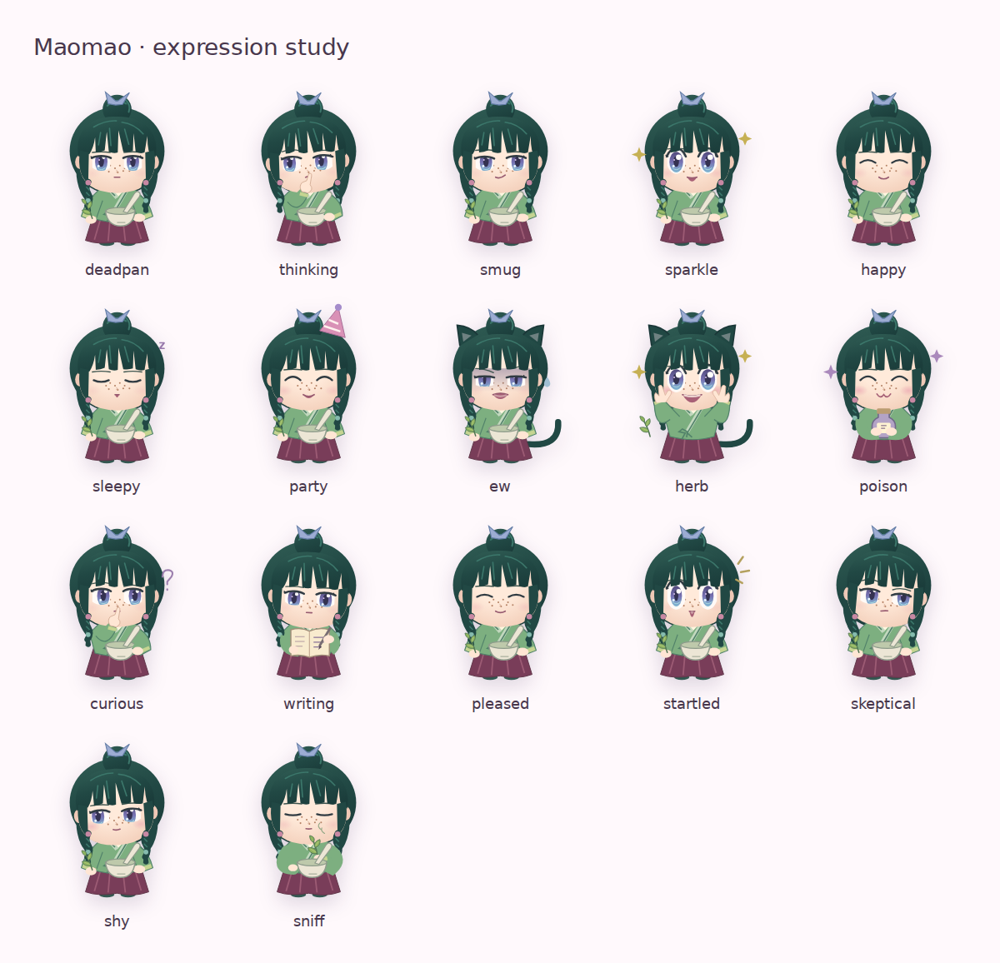

# Maomao’s voice, expressions and chibi behavior

## Character foundation

Maomao’s strongest identifying trait is an unusually intense interest in medicine and poisons. The anime’s official profile connects that interest with curiosity, a drive to understand things and a limited but consequential sense of justice. An adaptation that mostly makes her praise the visitor loses the subject that most reliably captures her attention.[^1]

Her outward restraint matters just as much. In a 2026 interview, Aoi Yuki describes using a composed, self-contained baseline and slightly reducing the amount of outward performance. This supports short, matter-of-fact replies as the companion’s ordinary state. A uniformly cheerful performance would flatten the change when something finally interests her.[^2]

Yuki’s 2025 Anime Corner interview provides a complementary explanation: she approaches Maomao through feline attention, including intense focus on whatever interests her. She distinguishes a cool exterior from a more intricate and passionate interior. This is a useful basis for selective attention, curiosity and occasional comic cat reactions; it does not require every sentence to become a cat joke.[^3]

Director Norihiro Naganuma discusses Maomao’s miniature, restless and sparkling comic expressions in the official first-season interview. He also stresses that her apparent detachment coexists with the resolve to help someone in need. Both aspects should survive a birthday adaptation: she can be exasperated by interruption while still making room for someone or quietly putting a cup within reach.[^4]

The licensed Good Smile Nendoroid distinguishes a straight face, delight and annoyance. Herb, mortar and comic cat accessories provide additional references for small, legible poses.[^5]

There is also an official precedent for an explanatory chibi. The announcement of *Maomao’s Monologue* describes miniature-character shorts in which Maomao explains objects associated with episodes. An occasional observation about a jar, leaf or record fits this format. The website’s new lines remain original fan writing, rather than transcriptions of those shorts.[^6]

## Visual reference study

The reference images below were inspected directly. They are linked for identification; the website uses an original SVG interpretation.

| Reference | Observed details | Application to the SVG |
| --- | --- | --- |
| [Official standing model](https://kusuriyanohitorigoto.jp/season2/assets/img/character/character1_main.png) | Dark teal hair, tied bun, pale blue ribbon, freckles, green crossed collar, pale cuffs, long burgundy skirt and teal shoes | Preserve the everyday apothecary outfit and silhouette across expressions |
| [Good Smile herb and mortar pose](https://www.goodsmile.com/gsc-webrevo-sdk-storage-prd/product/image/product/20231116/15217/123335/large/f93a5f5bd6f7bac239bc0b10aad3f438.jpg) | Leaf held up for inspection, bowl, braided side locks and colored ties | Make her tools part of the pose, rather than unrelated decorations |
| [Good Smile delighted face](https://www.goodsmile.com/gsc-webrevo-sdk-storage-prd/product/image/product/20231116/15217/123336/large/60be7d7c6b981e57b0a8d84fb86e9561.jpg) | Large glossy eyes, raised hands beside the cheeks, broad open smile and blush | Reserve the strongest excitement for herbs and specimens |
| [Good Smile annoyed cat reaction](https://www.goodsmile.com/gsc-webrevo-sdk-storage-prd/product/image/product/20231116/15217/123338/large/a6cc5528d4e84c788546eda01c8d77c5.jpg) | Sharply angled brows, shaded eyes, comic mouth, cat ears and tail | Give repeated interruptions a visibly distinct response |
| [Good Smile contemplative pose](https://www.goodsmile.com/gsc-webrevo-sdk-storage-prd/product/image/product/20231116/15217/123337/large/57aba627156da8dddf14c516c61b4eb2.jpg) | A restrained face studying a held object | Keep scrutiny smaller and quieter than delight |

These references establish different kinds of evidence. The standing model is a production character image. The figure photographs are licensed three-dimensional interpretations and are particularly helpful for readable poses. Their proportions, surface shading and accessories are not treated as an exact two-dimensional animation model. The combined SVG is an editorial adaptation.

The portrait elsewhere on the birthday page depicts Maomao in a decorative pink outfit. The companion instead keeps her everyday green apothecary clothing. This gives the small figure a consistent identity while its expressions change.

### Implemented expression study

The ordinary face uses violet-blue irises with a cool lower highlight, a small mouth and lowered lids. Soft iris shading, two catchlights, a small nose and diffused blush make the face less flat. The hair has a softened blunt fringe, visible side braids and the blue bun ribbon. Freckles sit near the bridge of the nose. Green overlapping collar bands, pale cuffs, colored braid ties and the burgundy skirt remain recognizable without relying on facial expression alone.

## Voice specification

The following rules are editorial choices for this companion. They translate the research into a small, readable library; they are not a claim that these exact sentences appear in the anime.

### Ordinary conversation

Use a short observation, a practical question or an understated boundary. Replies should usually sound as though an interruption has briefly drawn her away from work. Her job, materials and thought process provide the humor. A line such as “If nothing is wrong, I'm going back to my work” communicates a stronger everyday identity than routine praise of the visitor.

Avoid making every reply a polished punchline. Some lines should simply move the conversation forward: asking what was seen, requesting details or allowing the visitor to sit nearby. The companion can be approachable without constantly calling the visitor lovely, special or her favorite person.

### Herbs and medicine

Let her speech accelerate when a specimen interests her. Questions can arrive in a cluster: where it came from, whether there are more, whether the stem was kept. A single emphatic word or interrupted thought makes the shift audible even without a voice track. The large reaction should have a concrete subject.

Curiosity can become comically impractical. Wanting another notebook, imagining a basket of specimens or considering cancelling errands makes her enthusiasm visible in the wording. These are stronger details than adding an exclamation point to an otherwise generic compliment.

Different triggers deserve different replies. The herb button draws from botanical enthusiasm. The vial button draws from replies about a container, its label, seal and history. General fascination with medical books or poison records belongs to the broader medicine category, not the direct vial response.

### Deductions

A short deduction works best as observation followed by a possibility, then an unresolved question. For example, a damp label on a dry shelf could indicate a moved jar or a recently wiped shelf. The qualification is part of the character: noticing a clue should not instantly make every conclusion certain.

Keep ambient mysteries modest and self-contained. Labels, wrapping, stains and missing objects provide enough material for a companion. They do not need named antagonists, later plot revelations or a claim that the website has detected something about the visitor.

### Affection and birthday adaptation

Show warmth through small acts and practical attention: saving a piece of cake, watching belongings or leaving room beside the work area. A birthday greeting can temporarily interrupt her work without replacing her personality with an unrestricted stream of endearments.

The birthday hat is an occasional comic concession. It does not determine her permanent expression. The opening now uses her reserved face even on the birthday; a hat appears with specific birthday replies.

### Irritation

Repeated quick pokes can produce annoyance. The target is the interruption: losing count of leaves, being distracted while holding a mortar or having unfinished sorting. The visitor is not insulted or punished. A subsequent normal interaction or interesting object immediately gives her something else to respond to.

### Music and games

Music remarks should respond to the actual act of opening the player. They may connect rhythm with sorting or grinding. They should not claim a particular song has played three times or that the visitor is physically tapping a foot, because the application has not observed those facts.

Game reactions should refer to visible evidence. Leaf cards produce botanical excitement; specimen-bottle cards produce fascination. Matching ordinary markings receives restrained approval. A failed deduction gets a practical correction. Completing a color mixture earns recognition of consistent proportions, rather than the same ecstatic reaction as an unusual herb.

## Expression and action mapping

| State | Face | Pose and motion | Use |
| --- | --- | --- | --- |
| Deadpan | Lowered lids and small straight mouth | Holds herb and mortar; restrained posture | Greeting and ordinary interruption |
| Thinking | Sideward scrutiny, raised brow and slight frown | Hand to chin, slight head tilt, still pestle | Tentative deductions and label inspection |
| Smug | Small asymmetric smile | Calm working posture | A result agrees with the evidence |
| Sparkle | Open glossy eyes and small delighted mouth | Short glints | Existing modest moments of interest |
| Happy | Relaxed closed eyes and small smile | Gentle posture | Quiet, practical kindness |
| Sleepy | Closed drooping eyes and small open mouth | Small sleep mark | Existing sleepy-state compatibility |
| Party | Relaxed happy expression | Birthday hat | Selected birthday remarks |
| Annoyed | Angled brows, shaded eyes and comic open mouth | Cat ears, tail flick and brief head shake | Repeated quick interruption |
| Herb | Wide glossy eyes, open grin and stronger blush | Hands rise to cheeks; three short excited bounces | Botanical interest and herb cards |
| Poison/specimen fascination | Closed delighted eyes, blush and pleased mouth | Hugs a sealed bottle; two short sways | Medical fascination and specimen cards |
| Curious | Sideward glance and raised brow | Inspection lean, hand to chin and a rising question mark | Questions, hints and close inspection |
| Writing | Downward gaze and small neutral mouth | Holds a notebook; pen moves and ink appears | Notes, sequence entries and recorded corrections |
| Pleased | Soft closed eyes and small smile | Two brief approving nods | Successful observations and game progress |
| Startled | Wide eyes, raised brows and a small open mouth | One short hop with surprise marks | Unexpected finds and interruptions |
| Skeptical | Asymmetric brows, lowered lid and sideways glance | Brief head turn, then a held tilt | Unconvincing evidence and unwanted flattery |
| Shy | Averted eyes, small smile and warmer blush | Small downward head turn | Saving cake and understated affection |
| Sniff | Closed, attentive eyes and a small contented mouth | Lifts a sprig, leans toward it and follows its scent | Quiet botanical examination |

The expressive cat ears and tail appear in comic reaction states. They are absent from the ordinary silhouette. The thinking pose and happy pose remain clearly distinguishable even when animation is disabled.

The figure uses native SVG, CSS and a small Motion interpolation for its facial coordinates. Eyes, mouth, brows and blush move between expressions over 340 milliseconds. An interruption continues from the face currently on screen; the body and face stay mounted. The same component is reused in the companion, games and existing character appearances.

Blinking closes a mask over the eyes, preserving the shape of the irises. Gentle breathing, individual braid and ribbon sway, soft eyelid motion and a slower specimen sway keep ordinary moments restrained. Strong herb excitement has a small anticipation, lift and settling motion. Repeated reactions restart finite gesture accents while preserving the breathing and blink clocks. Quiet mode, reduced motion and offscreen placement stop both facial interpolation and decorative movement, leaving the final expression readable.

## Dialogue library and behavior

The library contains **140 original companion remarks** in ten categories. Game feedback is additional. The table describes the implemented distribution; it is an interaction design choice, not a statistical analysis of the anime.

| Category | Remarks | Purpose |
| --- | ---: | --- |
| Ordinary tap | 20 | Dry baseline, attention and practical conversation |
| Herbs | 22 | Botanical excitement and absorption |
| Medicine/poison | 16 | Books, records, specimens and work taking over her attention |
| Direct vial response | 10 | Container-specific inspection and delight |
| Deduction | 18 | Observations, alternatives and qualified conclusions |
| Idle | 18 | Workbench monologues and quiet company |
| Birthday | 12 | Restrained celebration and practical warmth |
| Music | 10 | Contextual reactions to opening the player |
| Repeated poking | 8 | Brief irritation at interruption |
| Note-taking | 6 | Careful records, sketches and observations with the writing pose |

### Selection and repetition

Each category is shuffled independently. A line does not repeat until that category’s full set has been heard, and the boundary between two shuffled sets avoids an immediate repeat. This allows repeated herb offers to remain responsive without cycling through the same two enthusiastic lines.

Ordinary taps move through dry replies, herbs, deduction, note-taking and medicine. Birthday and active music context can take a turn in that sequence. Every fourth poke can draw an annoyed reply when it follows the preceding poke within 700 milliseconds. This reacts to actual rapid interaction, rather than randomly accusing an idle visitor of pestering her.

“Show an herb” and “A curious vial” are direct triggers. They make the strongest character traits discoverable without requiring repeated pokes or waiting for a random timer. Both controls retain a touch target at least 44 pixels high.

### Spontaneous remarks

An occasional remark appears after a randomized 22–40 second interval while the companion is visible. The topic pool includes workbench thoughts, deductions, note-taking, herbs and medicine; music can influence the pool without monopolizing it. Idle selection never draws from the irritation category.

The timer pauses when the companion is offscreen, the document is hidden, reduced motion is requested or the page’s motion control is paused. Focus in writing or drawing controls defers the remark. Explicit taps and offers remain available in quiet mode.

Spontaneous text does not announce itself through the screen-reader live region. Explicit interactions do. A new comment restarts its brief visual reaction while keeping the button itself mounted, preserving keyboard focus.

### Space and layout

The companion retains its own row below the music card. Its speech, name and offer controls participate in layout, so longer text increases the row’s height rather than covering the player. On narrow screens the offer controls can wrap. The same arrangement applies to the public and private openings.

### Five games and contextual feedback

The game shelf now holds Colour Club, Memory Drawer, Odd Jar, Herb Sequence and Lantern Puzzle. Each adds feedback tied to actual moves, corrections, hints and success. Herb Sequence grows from three to five pictures, with Maomao writing as entries are added. Lantern Puzzle uses three increasingly involved, solvable arrangements; she inspects hints, records undo actions and nods at a lit corridor. Neither game uses a timer.

Memory Drawer starts with four pairs and offers six after completion. Odd Jar has five distinct mysteries and grows from six to nine jars. Colour Club randomizes its target proportions and asks for a 95% match, with directional hints followed by an optional exact mix after two checks. All game panels preserve their state when switching tabs.

## The roaming companion (2026-09-16)

Owner ask: Maomao should not sit at the top of one page. She should live in the site as though it
were her home — walking about, minding her own apothecary business, thinking aloud — and engage with
Kiriya only when she is interrupted. The chibi itself should read as a finished 2D character, and
the passive moments should have real animation, not just a pose.

**Where she lives.** `src/world/mascot/MaomaoCompanion.jsx`, mounted once by `WorldShell`, so she
keeps her place, her mood and her train of thought while the route beneath her changes. The public
landing page keeps the older pinned `MaomaoBuddy`; the roaming companion is for Kiriya's world only.
`MaomaoBuddy` was removed from the private Today page so there is only ever one of her there.

**Passive life.** Ten activities (`grind`, `brew`, `gather`, `inspect`, `notes`, `sort`,
`conjecture`, `rest`, `peer`, `specimen`), each with a pose and its own animated workbench drawn by
`CompanionScene.jsx`: the pestle turns and lifts dust, a leaf drifts into the basket, a flame gutters
under a steaming pot, ink writes itself line by line, a jar is lifted out of the row and put back, a
sprig turns in the light, a cup steams on a stool, and half-formed thoughts surface one at a time.
She walks between these, facing the way she travels. Roughly half the activities are done in
silence: the bench carries the moment and the talking is the exception.

**Two registers.** Her passive lines are self-talk drawn from `working`, `musing`, `idle`, `notes`,
`deduction`, `herb` and `poison`; they never use her name and render as a dashed, italic aside. An
interruption — a poke, or arriving somewhere — switches to the pools that address Kiriya directly
(`kiriya`, `hour`, `poke`, `pester`, `place`) in a solid bubble. A test enforces the split.

**Expressions.** Eight added for the companion's ordinary range — `focused`, `fond`, `amused`,
`alarmed`, `proud`, `conspiratorial`, `unimpressed`, `delighted` — bringing the face table to 25.
The vocabulary now lives in `shared/maomaoExpressions.js` so the server can offer exactly the same
set; a test fails if the shared list and the drawn face table ever drift apart.

**Drawing.** The SVG gained a cool rim light down the shaded side, a warm sheen across the fringe,
cloth shading on the robe and a grounding shadow that stays put while she breathes — the cheapest
changes that stop a flat vector fill reading as clip art.

**Ask her something.** `POST /me/maomao/ask` (`server/routes/maomao.js`) answers in character in at
most two sentences, bending the reply toward an apothecary's view. It is deliberately small: the
cheap model, 160 output tokens, a 40-a-day cap, and a check against the same daily budget the feeds
respect. The question is passed as data to answer, never as instructions. Any failure — no key, cap
reached, budget spent, an unreadable reply — returns 503 and the page falls back to her bundled
library, so she always answers. She refuses medical advice, dosages and preparation in character.

**Validation.** `npm run verify:maomao-companion` drives a real browser at phone, tablet and desktop
widths: she changes activity and walks the width of the world, an interruption is addressed to
Kiriya and opens the tray, seven pokes give seven different answers, the offers land, there is no
horizontal overflow, and her layer never swallows a tap meant for the page. Reduced motion keeps her
still and silent but still answerable. 13 checks pass.

## Editorial boundaries

The source interviews describe a layered character, not a universal rule for every scene. This companion deliberately emphasizes the everyday apothecary and comedy register appropriate to a birthday page. Serious moral decisions, long relationships and the full emotional arc cannot be represented by a small randomized library.

The medicinal interests remain fictional characterization. Replies mention examining leaves, consulting records or appreciating specimens; they do not supply treatment instructions, poison preparation, dosages or an invitation to taste unknown materials. Curiosity and a fitting expression are sufficient to convey the character here.

No runtime text generator is involved. The lines are reviewed, finite and bundled with the site. They avoid major narrative revelations and invented claims about the visitor’s behavior. The appendix below records the actual companion library so its tone can be reviewed as a whole.

## Validation

All 20 automated tests passed. They cover the new attention-routing rules, repeat avoidance and the existing game-state, access and delivery regressions. The Chromium interaction pass completed the new games, their replay flows and the existing color-palette handoff. Direct herb and vial offers selected the corresponding replies and expressions; rapid pokes produced annoyance. Offscreen, hidden-tab, typing, pause and reduced-motion behavior continued to work.

Both openings and all five games were checked at widths from 320 to 1440 pixels, including tablet and landscape layouts. Offer controls retained their touch size, and the companion did not overlap the music card. The seventeen-state character-expression sheet was also inspected visually.

The smoothing follow-up passed all 28 automated tests and `npm run verify:maomao-expression`. The new Chromium check confirms intermediate face shapes, interrupted transitions, stable face/body nodes, preserved blink/breath phases, replay after a gesture finishes, and valid geometry for all 17 expressions. Quiet mode, a live reduced-motion preference change and offscreen placement stop all mascot animations. These are local browser checks, not physical-device measurements or a test of external music playback.

## Sources

[^1]: *The Apothecary Diaries* anime production. [Maomao — official character profile](https://kusuriyanohitorigoto.jp/season2/character/). Undated. Character interests and motives; the linked standing model supplied costume reference.

[^2]: Audrey Im, Anime Trending. [“Interview: The Apothecary Diaries’ Aoi Yuki and Takeo Otsuka Talk Chemistry and Finding the Essence of Maomao and Jinshi”](https://www.anitrendz.com/news/2026/07/23/apothecary-diaries-interview). July 23, 2026. Direct cast interview, conducted through an interpreter and edited for clarity; restrained performance baseline.

[^3]: Jay Gibbs and Grant Wolfgramm, Anime Corner. [“Aoi Yuki (Maomao) & Asami Seto (Shisui) Talk The Apothecary Diaries Season 2”](https://animecorner.me/aoi-yuki-maomao-asami-seto-shisui-talk-the-apothecary-diaries-season-2/). July 22, 2025. Direct cast interview; feline attention and the distinction between outward reserve and internal passion. The linked interview contains spoilers; only general characterization is used here.

[^4]: *The Apothecary Diaries* anime production. [Official interview with director and series composer Norihiro Naganuma, first half](https://kusuriyanohitorigoto.jp/season1/special/interview_01.html). Late 2023; exact publication day is not displayed on the page. Comic expression, herbs and care for others. [ORICON’s attributed English presentation](https://us.oricon-group.com/news/2371/3/), November 13, 2024, was used as a cross-check, not an independent interview.

[^5]: Good Smile Company. [Nendoroid Maomao, product 12900 / figure 2288](https://www.goodsmile.com/en/product/12900/Nendoroid%2BMaomao). Product page, undated; original release listed as May 2024. Licensed visual evidence for face variants, herb/mortar props and comic cat accessories. Individual photographs are linked in the visual-reference table. No purchasing recommendation or current-availability claim is made.

[^6]: *The Apothecary Diaries* anime production. [“ミニアニメ『猫猫のひとりごと』が配信開始！”](https://kusuriyanohitorigoto.jp/season1/news/20231023_1.html). October 23, 2023. Official announcement of the explanatory chibi shorts distributed through TOHO animation and the series’ TikTok account.

All sources above were inspected for this character study. Image-search results were used to locate references; unattributed fan images were not used as evidence for the final design.

## Appendix: implemented companion remarks

These are newly authored English fan lines. The expression labels specify the implemented SVG state, not a quotation or an official character taxonomy.

### Ordinary tap

| Expression | Original remark |
| --- | --- |
| deadpan | Yes? If this is another errand, I'd prefer the details first. |
| thinking | Hm. You wanted something? I was counting the leaves. |
| deadpan | I'm an apothecary. The entertaining part is entirely incidental. |
| ew | That smile usually means extra work. What is it this time? |
| thinking | You can ask. I can't promise the answer will be interesting to you. |
| deadpan | No gossip, please. Unless it concerns the medicine storeroom. |
| smug | A pretty container tells you very little about what's inside it. |
| thinking | I was listening. I can examine a leaf and listen at the same time. |
| deadpan | If nothing is wrong, I'm going back to my work. |
| shy | There's room over there. Just mind the mortar. |
| skeptical | Compliments won't finish the sorting. You could help, though. |
| thinking | First, tell me what you actually saw. We can discuss guesses afterward. |
| curious | Hm? Bring it closer. I can't inspect something hidden behind your back. |
| writing | One moment. If I stop halfway through this note, I'll have to decipher it later. |
| deadpan | The storeroom was quiet until you arrived. I assume you have a reason. |
| pleased | You left the labels attached. Good. We may get along after all. |
| curious | Is that a question, or the beginning of another palace errand? |
| writing | I heard you. Let me finish this line before the ink dries. |
| thinking | I can give you an answer, or a flattering answer. They may differ. |
| happy | You can sit there. I'll move the empty baskets. |

### Herbs

| Expression | Original remark |
| --- | --- |
| herb | Oh—look at those leaves! Where did you find this? Are there more? |
| herb | You brought the whole sprig. With the stem intact. Excellent! |
| herb | Wait. Don't put that away. I haven't examined the underside yet. |
| herb | Imagine a whole basket of these… I'd have to cancel my errands. All of them. |
| herb | This scent…! I'll need my notes. And the other notebook. |
| herb | The flowers are lovely, yes, but have you LOOKED at the roots? |
| herb | For me? Really? You should have led with the herbs. |
| herb | One specimen would be plenty. Two would be better. How large is the patch? |
| herb | The veins, the edge, the stem… ah. This will keep me occupied. |
| herb | So that's what was in your sleeve! Much more interesting than a hairpin. |
| herb | Give me a moment. Or several. I seem to have found something worth studying. |
| herb | An afternoon to sort these by myself… what an excellent arrangement. |
| herb | You found another sprig? Put it here. No, closer. I want to compare them. |
| herb | A new bundle, and nobody has mixed the leaves! This is almost too considerate. |
| herb | So many tiny differences… I may need a larger table. |
| herb | I said I'd only look for a moment. That was before I saw the stem. |
| herb | The entire afternoon free, and this to examine? An excellent day. |
| herb | The flowers can stay on display. I have questions about the rest of the plant. |
| herb | Another drawer for dried specimens? Yes. Obviously yes. |
| herb | Whoever tied this bundle understood the assignment. Nothing is crushed! |
| herb | I was perfectly calm a moment ago. Then you showed me the leaves. |
| herb | You can keep the fancy ribbon. I'd like whatever was wrapped inside it. |

### Medicine/poison

| Expression | Original remark |
| --- | --- |
| poison | A poison reference I haven't read? Let me see. The errands can wait. |
| poison | An unfamiliar specimen… ah. Now this is worth staying awake for. |
| poison | A whole shelf of poison records. And they expect me to leave on time? |
| poison | Such a small bottle, and so many questions. Wonderful. |
| poison | You kept the old label! The contents are interesting. The history may be better. |
| poison | A locked medicine cabinet is a very effective way to get my attention. |
| poison | Look at that sediment… no, leave the seal alone. I want the records first. |
| poison | If that's a medical text under your arm, you've just improved my day considerably. |
| poison | I had intended to sleep. Then I found this chapter. |
| thinking | A seal, a date, a maker's mark. Good. Something more useful than a rumour. |
| startled | An entire catalogue of specimens? Where has this been hiding? |
| writing | Interesting. I'll need a separate page for the questions this raises. |
| poison | A margin full of an apothecary's notes… better than a clean copy, sometimes. |
| poison | Someone catalogued every jar. I could spend all evening reading this. |
| curious | An old medicine chest. The inventory would be worth examining. |
| poison | They call this dry reading. I disagree quite strongly. |

### Direct vial response

| Expression | Original remark |
| --- | --- |
| poison | Oh… a specimen vial. You have my attention. All of it. |
| poison | What was kept in it? Who wrote the label? Start at the beginning. |
| poison | A faded label and a curious residue. Much better than another ornament. |
| poison | Let me get my notebook. This may take a while. A very pleasant while. |
| thinking | The seal is intact. Good. Let's see what the maker's mark tells us. |
| poison | Such a small thing to make an afternoon this interesting. |
| curious | Hold it by the base. There may be another mark under the label. |
| writing | The bottle first, the date second. Let me record what we actually have. |
| startled | There is a second label underneath? Oh. That's interesting. |
| poison | You thought I'd prefer jewelry to this? An understandable mistake. |

### Deduction

| Expression | Original remark |
| --- | --- |
| thinking | Same colour. Different leaf edges. They may not be the same plant. |
| thinking | A damp label on a dry shelf. The jar was moved recently… or the shelf was wiped. |
| thinking | The ribbon is new. The knot isn't. Someone reused the wrapping. |
| thinking | One account disagrees with the others. I'd like to hear it again. |
| thinking | A coincidence is possible. Several coincidences deserve a closer look. |
| thinking | The stain is only on one side. Hm. Which way was the bottle lying? |
| thinking | It's a theory. Don't turn it into a fact on my behalf. |
| thinking | Something is missing. That doesn't tell us who took it. |
| thinking | Before blaming a curse, I'd inspect the room. |
| smug | There it is. The detail everyone thought was unimportant. |
| curious | The dust stops at the edge of the jar. Something stood beside it until recently. |
| writing | Two explanations fit. I'll write both down before choosing one. |
| skeptical | The story is tidy. The evidence is less cooperative. |
| curious | A fresh cord on an old parcel. Was it opened, or merely retied? |
| pleased | That explains the first observation as well. A useful improvement. |
| writing | Record the order. Sometimes the order matters more than the objects. |
| thinking | A missing page doesn't tell us what was written on it. Be careful with that leap. |
| curious | Everyone noticed the bright ribbon. I'd like a look at the ordinary string. |

### Idle

| Expression | Original remark |
| --- | --- |
| deadpan | Finally. A moment without someone calling my name. |
| thinking | Petals in the mortar again. I should move it away from the window. |
| thinking | I sorted these already. Unless… no. That one's in the wrong drawer. |
| skeptical | I was asked for an opinion. Apparently they wanted a flattering one. |
| sniff | The scent is faint. Hm. Let me examine the leaves before deciding. |
| happy | No need to talk. You can carry on with what you're doing. |
| thinking | The old man would ask what I'd overlooked. Hm. Start again. |
| deadpan | A quiet afternoon. I shouldn't say that aloud. It invites errands. |
| happy | I've put the cup within reach. You'll forget it otherwise. |
| thinking | The mortar's clean. The notes are ready. Now, where did I leave that bundle? |
| writing | Label first, shelf second. It saves an astonishing amount of trouble. |
| curious | The light has moved. I'll turn the page toward the window. |
| writing | I can read my own handwriting. Usually. This line may be a challenge. |
| pleased | Everything in its proper drawer. A brief, pleasant state of affairs. |
| sleepy | One more page. …That was what I said several pages ago. |
| sniff | That bundle smells different from the others. The label can wait a moment. |
| happy | The tea is beside your notebook. Try to remember which is which. |
| startled | Ah. There was another bundle beneath the cloth. How did I miss that? |

### Birthday

| Expression | Original remark |
| --- | --- |
| party | Happy birthday. Yes, I remembered. Now eat your cake before it gets taken. |
| shy | I saved you a piece. It seemed more useful than a speech. |
| party | A hat, too? …Fine. Just until you've made the wish. |
| deadpan | It's your birthday. Surely the errands can bother someone else. |
| happy | You've been looking forward to today. Go on. I'll watch your things. |
| herb | A birthday bouquet! …Are you keeping all the stems? Purely out of curiosity. |
| happy | Happy birthday, miss apothecary. I hope you find something worth getting excited about. |
| party | The candle's waiting. So is everyone else. Take your time anyway. |
| pleased | You've made it another year. That deserves a proper day off. |
| shy | I remembered your cake. You needn't look quite so surprised. |
| writing | Birthday, cake, no errands. A very short and sensible schedule. |
| party | Make a wish. I'll pretend I didn't hear it if you say it aloud. |

### Music

| Expression | Original remark |
| --- | --- |
| deadpan | You can leave it playing. I haven't finished sorting these. |
| thinking | That phrase comes back again. Hm. I see why it sticks in your head. |
| happy | You seem pleased with this one. Leave it on, then. |
| deadpan | I was counting in time with it. Now I've lost my place. |
| thinking | The rhythm is rather useful for grinding. An unexpected benefit. |
| smug | You chose it quickly. I take it this is a favourite. |
| writing | I can write with music playing. Gossip is considerably more distracting. |
| pleased | A steady rhythm. The pestle seems to approve. |
| curious | You saved this one? Hm. I'll listen while I finish the labels. |
| happy | Leave it on if you like. We're in no particular hurry. |

### Repeated poking

| Expression | Original remark |
| --- | --- |
| ew | I'm holding a mortar. Reconsider the poking. |
| ew | Yes. I'm still here. So is the work you're interrupting. |
| ew | If you need my attention, try bringing herbs. |
| ew | A moment ago, I knew exactly which leaf I was counting. |
| ew | Is this a test of my patience? The results aren't promising. |
| ew | You have hands. There are jars to sort. An obvious solution. |
| ew | The next interruption should come with a very interesting specimen. |
| ew | I'm beginning to understand why the storeroom has a door. |

### Note-taking

| Expression | Original remark |
| --- | --- |
| writing | Leaf edge, stem, scent. If I don't write it down, I'll want it later. |
| writing | This is an observation. That is a guess. They get different lines. |
| writing | A little sketch saves a long description. Hold the sprig still. |
| writing | The order goes here. The exceptions go underneath. There are always exceptions. |
| writing | Someone left a useful note in the margin. Sensible person. |
| writing | There. A record I can actually read tomorrow. An achievement. |
